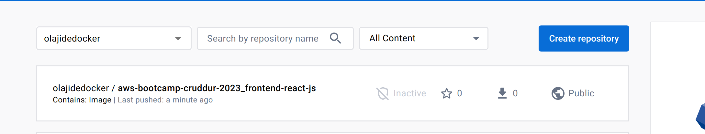

# Week 1 — App Containerization

# Required Homework

## Containerize Application (Dockerfiles, Docker Compose)

[Link to the backend docker file](../backend-flask/Dockerfile)

The application is running behind a Flask development server 

### Write the frontend docker file

[Link to the frontend docker file](../frontend-react-js/Dockerfile)

### Write the docker compose file
[docker-compose](../docker-compose.yml)
### Run the application in gitpod

1. Launch the application in gitpod
2. Execute the docker-compose
   
```bash
docker-compose -f docker-compose.yml  up --build
```
3. Make the ports public
4. Open the cruddur URL in your browser


## Document the Notification Endpoint for the OpenAI Document

[Notification OpenAPI](../backend-flask/openapi-3.0.yml#L151-165)


## Write a Flask Backend Endpoint for Notifications


## Write a React Page for Notifications
Notification feature added to the application 

[Notification react js page](../frontend-react-js/src/pages/NotificationsFeedPage.js)

## Run Containers written in compose file and ensure it works
## Gitpod

### Create a table

```bash 
aws dynamodb create-table  --endpoint-url http://localhost:8000  --table-name Cruddur --attribute-definitions AttributeName=UIID,AttributeType=S AttributeName=Handler,AttributeType=S  --key-schema AttributeName=UIID,KeyType=HASH AttributeName=Handler,KeyType=RANGE --provisioned-throughput ReadCapacityUnits=1,WriteCapacityUnits=1 --table-class STANDARD --no-cli-pager
```


### List Tables
```bash
aws dynamodb list-tables --endpoint-url http://localhost:8000  --no-cli-pager
```

## Postgres

```bash
curl -fsSL https://www.postgresql.org/media/keys/ACCC4CF8.asc|sudo gpg --dearmor -o /etc/apt/trusted.gpg.d/postgresql.gpg
  echo "deb http://apt.postgresql.org/pub/repos/apt/ `lsb_release -cs`-pgdg main" |sudo tee  /etc/apt/sources.list.d/pgdg.list \
  sudo apt update \
  sudo apt install -y postgresql-client-13 libpq-dev
```

```bash
psql  --host 127.0.0.1 -Upostgres
postgres-# \l
```


# Homework Challenges
## Push and tag a image to DockerHub (they have a free tier)

Image is available to the public

Docker push


Docker hub 



Pull the image 

```bash
docker pull olajidedocker/aws-bootcamp-cruddur-2023_frontend-react-js:v2
```


## Use multi-stage building for a Dockerfile build Implement a healthcheck in the V3 Docker compose file

#### Frontend 

```bash
FROM node:16-alpine3.16 as build

ENV PATH /app/node_modules/.bin:$PATH
ENV PORT=3000
ENV NODE_ENV development

WORKDIR /frontend-react-js
COPY package.json .
COPY package-lock.json .
COPY . /frontend-react-js
RUN npm ci --silent
RUN npm run build

FROM node:16-alpine3.16 as prod

COPY --from=build /frontend-react-js/build /build

# Set the env to "production"
ENV NODE_ENV production
ENV npm_config_yes=true 
# Expose the port on which the app will be running (3000 is the default that `serve` uses)
EXPOSE ${PORT}
# Start the app
CMD [ "npx", "serve", "build" ]
```
## Implement a healthcheck in the V3 Docker compose file


1. Document health endpoint in the openapi file

```yaml
  /api/health:
   get:
     description: 'Return a health status'
     tags:
       - monitoring
     parameters: []
     responses:
       '200':
         description: Returns a status 200 code
```
2. Add health check endpoint in the backend app 

```python
@app.route("/api/health", methods=['GET'])
def health():
  data = { 'success': True, 'message': "healthy" }
  return data, 200
```

3. Add the health check in the docker-compose

```yaml
    healthcheck:
      test: ["CMD-SHELL", "curl -f http://127.0.0.1:4567/api/health && echo 'OK' || exit 1"]
      interval: 5s
      timeout: 2s
      retries: 3
```
## Research best practices for Dockerfiles and implement it in your Dockerfile
1. Create separate Dockerfile for production and dev 
2. Use a destroless base image to avoid unused library and improve the vulnerabilities
3. Builder images (multi-stage builds)
4. Use read only file system in the docker image
5. Reduce layers 
6. Add dockerignore file to avoid pushing unused file
7. Run Docker in rootless Mode
8. Avoid using the ` — privileged` flag

## Launch an EC2 instance that has docker installed, and pull a container to demonstrate you can run your own docker processes. 

### Create an instance 


### Pull the created image from docker hub


### Run cruddur within in the EC2 Instance and expose to a public port
I pull the image from dockerHub and ran it on with 3000:3000 host to
container port mapping


## Add synk integration

Scan the project by synk
