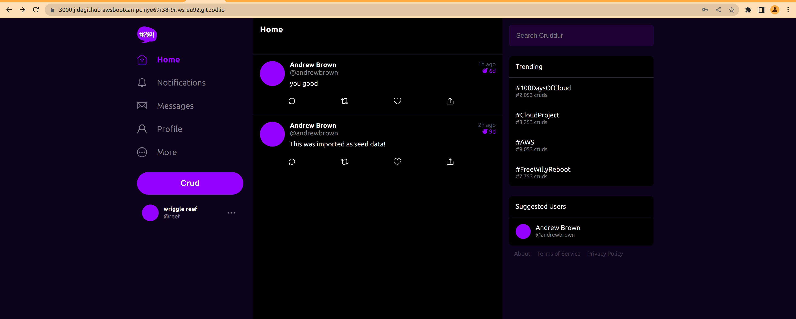
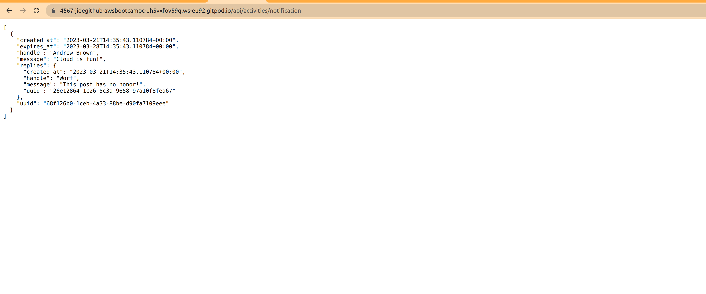
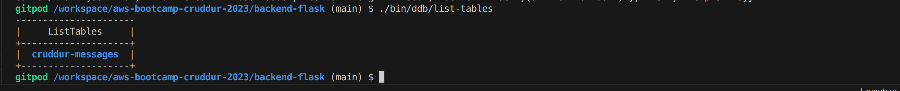
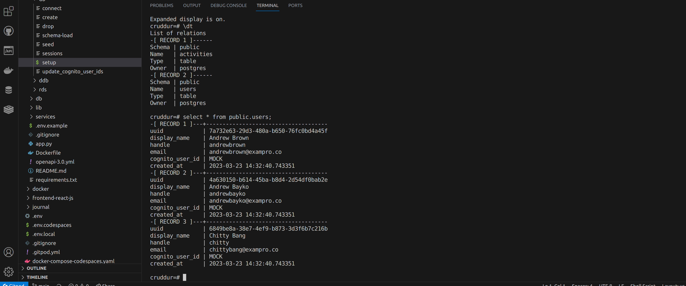
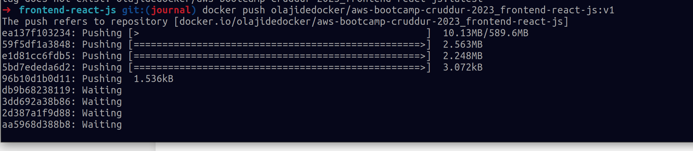
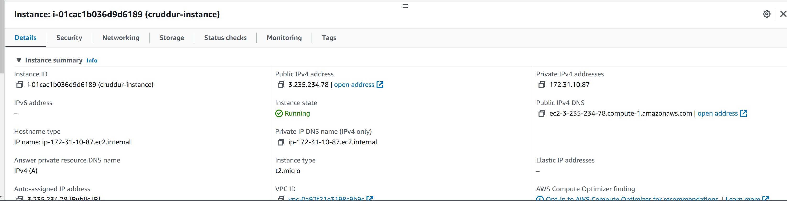
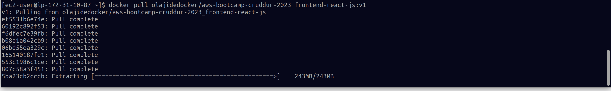
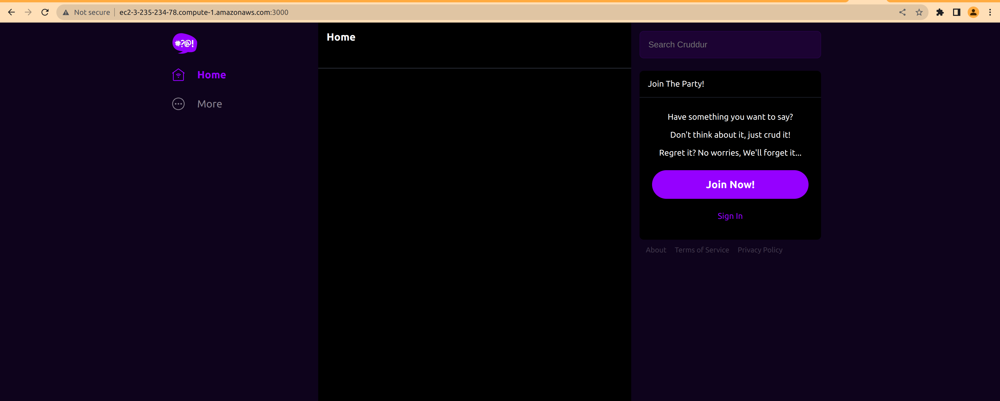
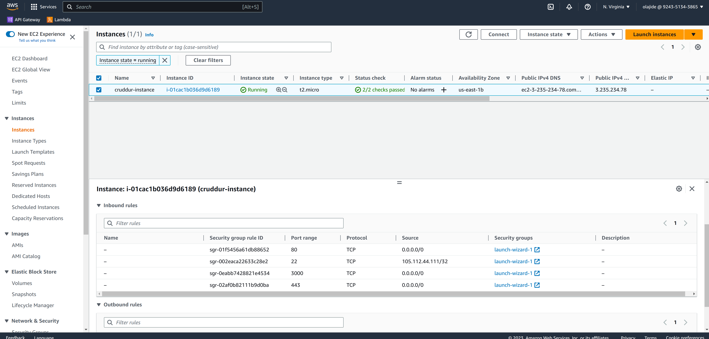
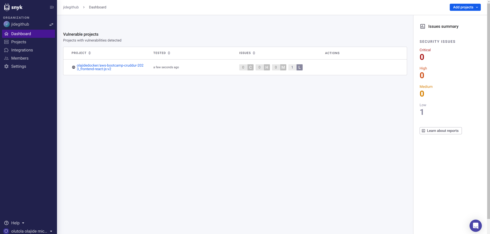

# Week 1 — App Containerization

# Required Homework

## Containerize Application (Dockerfiles, Docker Compose)

[Link to the backend docker file](../backend-flask/Dockerfile)

The application is running behind a gunicorn server [config file](../backend-flask/config/gunicorn.conf.py)

### Write the frontend docker file

[Link to the frontend docker file](../frontend-react-js/Dockerfile)

### Write the docker compose file
[docker-compose](../docker-compose.yml)
### Run the application in gitpod

1. Launch the application in gitpod
2. Execute the docker-compose
   
```bash
docker-compose -f docker-compose.yml  up --build
```
3. Make the ports public
4. Open the cruddur URL in your browser


## Document the Notification Endpoint for the OpenAI Document

[Notification OpenAPI](../backend-flask/openapi-3.0.yml#L151-165)


## Write a Flask Backend Endpoint for Notifications




## Write a React Page for Notifications
Notification feature added to the application 


## Run DynamoDB Local Container and ensure it works

## Local machine
### Create a table


### List Tables


### Create an Item

Please fine here the file used to create the item [Item file](../backend-flask/dynamo_db/items.json)

```bash
aws dynamodb  batch-write-item  --endpoint-url http://localhost:8000  --request-items file://backend-flask/dynamo_db/items.json --return-consumed-capacity TOTAL  --profile bootcamp --no-cli-pager
```


### List items
```bash
aws dynamodb scan  --endpoint-url http://localhost:8000 --table-name Cruddur --no-cli-pager
```


## Gitpod

### Create a table

```bash 
aws dynamodb create-table  --endpoint-url http://localhost:8000  --table-name Cruddur --attribute-definitions AttributeName=UIID,AttributeType=S AttributeName=Handler,AttributeType=S  --key-schema AttributeName=UIID,KeyType=HASH AttributeName=Handler,KeyType=RANGE --provisioned-throughput ReadCapacityUnits=1,WriteCapacityUnits=1 --table-class STANDARD --no-cli-pager
```


### List Tables
```bash
aws dynamodb list-tables --endpoint-url http://localhost:8000  --no-cli-pager
```


### Create an Item
Please fine here the file used to create the item [Item file](../backend-flask/dynamo_db/items.json)

```bash
aws dynamodb  batch-write-item  --endpoint-url http://localhost:8000  --request-items file://backend-flask/dynamo_db/items.json --return-consumed-capacity TOTAL --no-cli-pager
```


### List items
```bash
aws dynamodb scan  --endpoint-url http://localhost:8000 --table-name Cruddur --no-cli-pager
```


## Postgre

Here is the to install postgres in gitpod [install postgres](/bash/bootstrap_gitpod.sh)

```bash
psql  --host 127.0.0.1 --user postgres
postgres-# \l
```


# Homework Challenges

## Run the dockerfile CMD as an external script 

[Backend Docker file](../backend-flask/Dockerfile#L6)

[Frontend Docker file](../backend-flask/Dockerfile#L31)

The script is here [backend entrypoint](../backend-flask/entrypoint.sh) Or [frontend entrypoint](../frontend-react-js/entrypoint.sh)

The script take 1 argument (service name [FLASK, NODE]) and depend on the argument, the right application is launched.

Each application has their proper entrypoint for the feature cutom configuration.   


## Push and tag a image to DockerHub (they have a free tier)

The image is available to the public

Local push proof 



Docker hub 


Pull the image 

```bash
docker pull zk15xyz/cruddur-backend:latest
docker pull zk15xyz/cruddur-frontend:latest

```


## Use multi-stage building for a Dockerfile build Implement a healthcheck in the V3 Docker compose file

#### Frontend 

```bash
FROM node:16.18 AS base
COPY . /frontend-react-js

FROM base AS app
WORKDIR /frontend-react-js
RUN npm install

FROM app As Prod
CMD ["./entrypoint.sh", "NODE"]
```
#### Backend 

```bash
# For more information, please refer to https://aka.ms/vscode-docker-python
FROM python:3.10 AS base
RUN python --version

# Install required package 
RUN git version
EXPOSE 8080

# Keeps Python from generating .pyc files in the container
ENV PYTHONDONTWRITEBYTECODE=1

# Turns off buffering for easier container logging
ENV PYTHONUNBUFFERED=1

# Install pip requirements
COPY requirements.txt .
RUN python -m pip install -r requirements.txt 


FROM base AS app
WORKDIR /app
COPY . /app

# During debugging, this entry point will be overridden. For more information, please refer to https://aka.ms/vscode-docker-python-debug

# Creates a non-root user with an explicit UID and adds permission to access the /app folder
# For more info, please refer to https://aka.ms/vscode-docker-python-configure-containers

RUN adduser -u 5678 --disabled-password --gecos "" appuser && chown -R appuser /app
USER appuser

FROM app As Prod
# RUN pip install .
COPY config/gunicorn.conf.py  /etc/gunicorn.conf.py
CMD ["./entrypoint.sh", "FLASK"]
```
Demo 

https://user-images.githubusercontent.com/18516249/221060787-149f66da-4959-426a-8a84-aae177d4fa63.mp4

## Implement a healthcheck in the V3 Docker compose file


1. Document health endpoint in the openapi file

```yaml
  /api/health:
   get:
     description: 'Return a health status'
     tags:
       - monitoring
     parameters: []
     responses:
       '200':
         description: Returns a status 200 code
```
2. Add health check endpoint in the backend app 

```python
@app.route("/api/health", methods=['GET'])
def health():
  data = { 'success': True, 'message': "healthy" }
  return data, 200
```

3. Add the health check in the docker-compose

```yaml
    healthcheck:
      test: ["CMD-SHELL", "curl -f http://127.0.0.1:4567/api/health && echo 'OK' || exit 1"]
      interval: 5s
      timeout: 2s
      retries: 3
```

4. Configure the dependency in frontend service

```yaml
    depends_on:
      backend-flask:
        condition: service_healthy
```

If the health check fails, the application will stop running

### Demo
https://user-images.githubusercontent.com/18516249/221273746-66ff216b-525e-4814-97b5-3f5040bbf595.mp4

## Research best practices of Dockerfiles and attempt to implement it in your Dockerfile
1. Create separate Dockerfile for production and dev 
2. Use a destroless base image to avoid unused library and improve the vulnerabilities
3. Builder images (multi-stage builds)
4. Use read only file system in the docker image
5. Reduce layers 
6. Add dockerignore file to avoid pushing unused file
7. Run Docker in rootless Mode
8. Avoid using the ` — privileged` flag

## Launch an EC2 instance that has docker installed, and pull a container to demonstrate you can run your own docker processes. 

### Create an instance 



### Pull the created image from docker hub


### Run cruddur in the EC2 
I didn't uplaod my projet to the instance, I only uploaded the dockerFile and remove the volume part and execute the docker-compose up






## Learn how to install Docker on your localmachine and get the same containers running outside of Gitpod / Codespaces

1. Docker locally 

https://user-images.githubusercontent.com/18516249/220201375-0b20206e-be26-479b-af17-704fd9a63a14.mp4


1. Cruddur locally


## Add synk integration

Scan the project by synk
