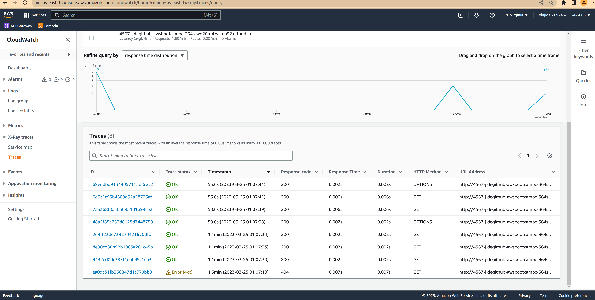

# Week 2 — Distributed Tracing

# Required homework
# Instrument our backend flask application to use Open Telemetry (OTEL) with Honeycomb.io as the provider

## Add opentelemetry to instrument flask app 
### Instrument flask application
[honeycomb module](../backend-flask/services/tracing/honeycomb.py)

### Add span to services for HoneyComb Tracing

   

# Run queries to explore traces within Honeycomb.io

## Home activities trace


## Show routes in honeycomb


## Query heatmap


## Query p99


## Honeycomb trace from gitpod


# Instrument AWS X-Ray into backend flask application

## Add a new python module to handle xray
[xray python module](../backend-flask/services/tracing/aws_xray.py)

This module contains the code to instrument a falsk application. 

## Configure and provision X-Ray daemon within docker-compose and send data back to X-Ray API
[xray docker-compose](../docker-compose.yaml#L69-L78)

Console output of xray daemon


## Observe X-Ray traces within the AWS Console

### trace list and graph


### all request http code percentage


### notification activities subsegment

[xray subsegment](../backend-flask/services/notifications_activities.py)

I managed to instrument this method with both xray and honneycomb, like that the traces are send to both of them


# Install WatchTower and write a custom logger to send application log data to CloudWatch Log group

### Python module to setup logging

[logging](../backend-flask/services/logging/logger.py)

In python you can get a logger at any point by instanciating the Logger class from logging module by passing the name of the logger 

The [logging](../backend-flask/services/logging/logger.py) method setup cruddur backend flask logger for the application. The cloud watch is enabled by setting the env variable ENABLE_CLOUD_WATCH_LOG, this way you have a sort of switch

```bash 
export ENABLE_CLOUD_WATCH_LOG="False"
```

The function will load the variable if defined and enable the cloudwatch. If this variable is absent, only console log is enabled

The function `setup_logger` is called one time at the initialization of the application

in app.py
```python 
from services.logging.logger import setup_logger
setup_logger()
```
Now, at any point in your application, you can get cruddur backend flask logger with the below code 

```python
import logging
logger = logging.getLogger("cruddur-backend-flask")
logger.info("INFO")
```
<!-- ### -->

aws cloud watch group


aws docker-compose flask service logs


# Integrate Rollbar for Error Logging

The module managing rollbar logging is [here](../backend-flask/services/logging/rollbar.py)
### Gitpod
1. Add `ROLLBAR_ACCESS_TOKEN: <TOKEN>` in you gitpod env variables
3. Launch the repo in gitpod
4. try access to `BACKEND_URL/rollbar/test`

## My Rollbar Current Error Statistic


