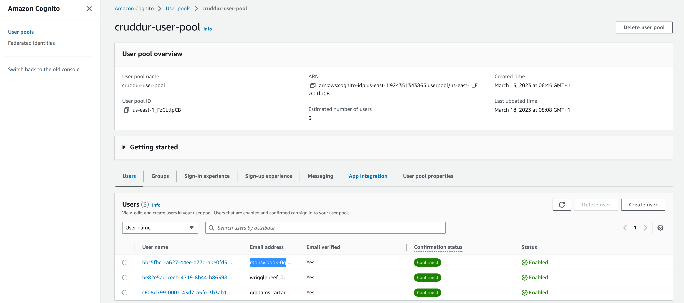
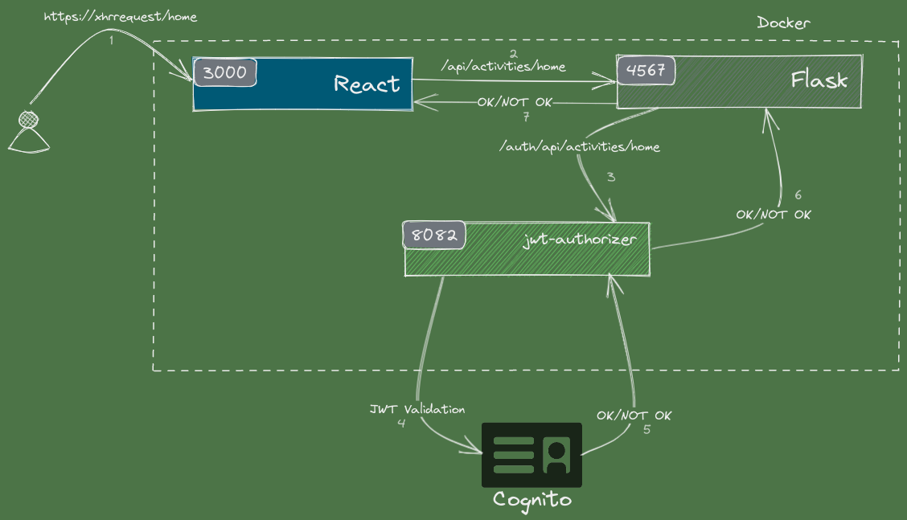
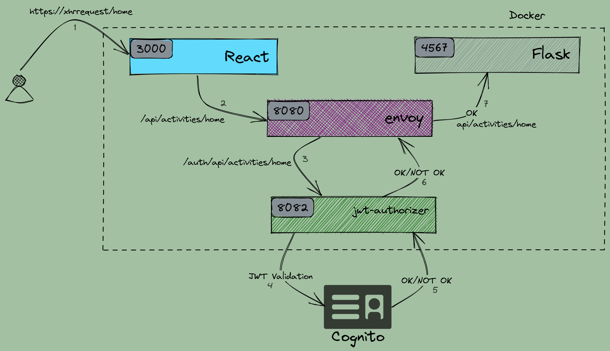

# Week 3 — Decentralized Authentication

# Setup Cognito User Pool

&nbsp;

# Implement Custom Signin/Signup/Custom/Confirmation Page/Custom Recovery Page

## POC
  

&nbsp;
# Homework Challenges 

## I took 2 Approaches
 - ### Flask Middleware Approach, can be combined @app.before_request decorator
 - ### Flask Middleware Decorator
&nbsp; 

# 1.Decouple the JWT verify from the application code by writing a Flask Middleware

[python JWT cognito Middleware file](../backend-flask/middleware/cognito_jwt_token_middleware.py)

# 2.Decouple the JWT verify from the application code by writing a Flask Middleware Decorator that intercepts every request before it gets to its corresponding routes

[python JWT cognito Middleware Decorator file](../backend-flask/lib/cognito_jwt_token.py)

# Decouple the JWT verify by implementing a Container Sidecar pattern using AWS’s official Aws-jwt-verify.js library

## Architecture 

### Workflow
1. Client sent a http request with `Authorization: Bearer TOKEN` in the  header 
2. Envoy receives the request and send it to jwt-authorizer application 
3. jwt-authorizer application connect to AWS cognito to validate the token 
4. If the token is valid
   1. jwt-authorizer response an http response with code 200
   2. Envoy forward the origin request to the flask app

5. If the token is node valid
   1. jwt-authorizer response an http response with code 403
   2. Envoy send an HTTP response to the client with code 403

## Node application with aws-jwt-verify official library
### `jwt-authorizer`

The application is packaged in a docker container and bind to port 8082
All the requests sent to `"/auth/*"` endpoint will be processed and run a JWT validation process with cognito.

[Application folder](../jwt-authorizer-api/)

[Docker File](../jwt-authorizer-api/Dockerfile)

### `Envoy front proxy`
Envoy front proxy is setup in front of the jwt-authorizer in order to proxy the http request send from the react app. All the requests with the path /api/ are intercepted and validated with the token via jwt-authorizer app. 

[Envoy config file](../envoy/front-envoy.yaml)

[Envoy Dockerfile](../envoy/Dockerfile)

<!-- ## POC 

 -->

# [Hard] Decouple the JWT verify process by using Envoy as a sidecar https://www.envoyproxy.io/

[Envoy Dockerfile](../envoy/Dockerfile)

[Envoy config file](../envoy/envoy-cognito.yaml)

<!--  -->

<!-- #### POC (watch the below video)

 -->