# Week 4 — Postgres and RDS

# Create RDS Postgres Instance

## Using AWS CLI

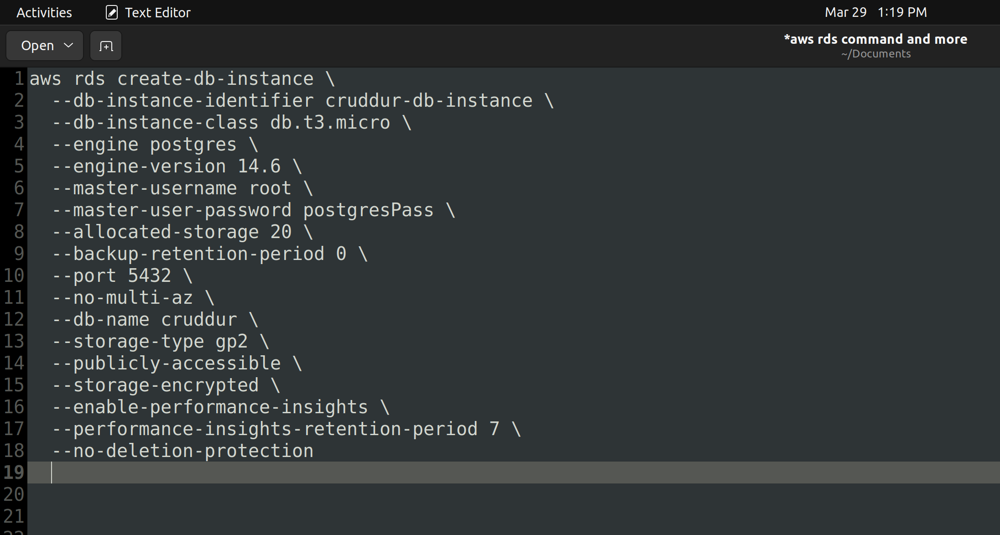

# Bash scripting for common database actions

Bash script performing different action on Postgres DB was created [db script](../backend-flask/bin/db)

## connect

Prod
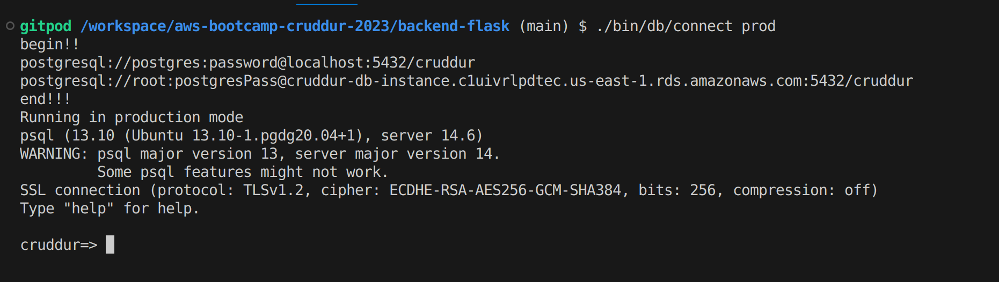

Local
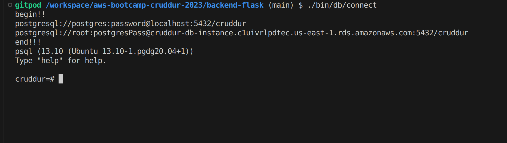

## create

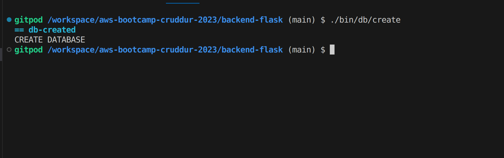

## drop

Local
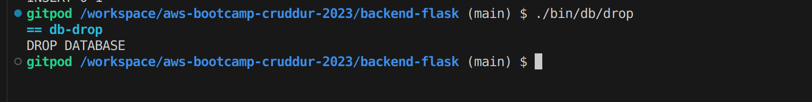

## load_schema

Local
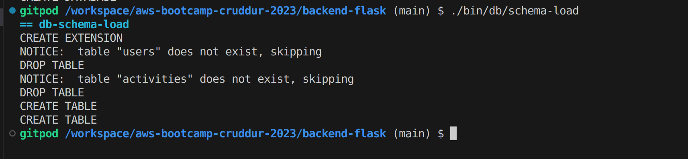

## seed

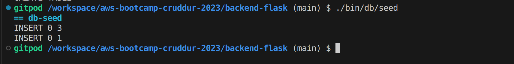

## sessions

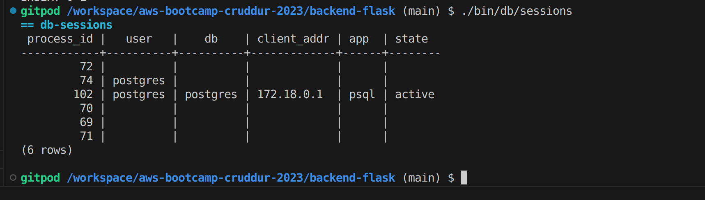

## setup

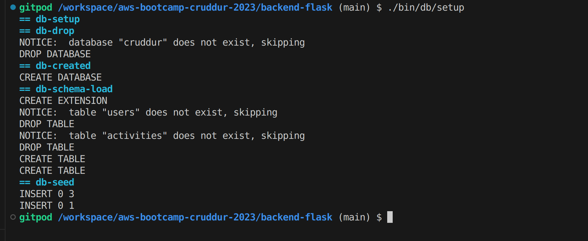

# Install Postgres Driver in Backend Application

[db driver](../backend-flask/lib/db.py)

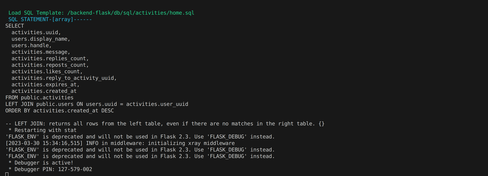

# Connect Gitpod to RDS Instance

## How it works:

[Update RDS Security Group Script](../backend-flask/bin/rds/update-sg-rule)  
Since a Cloud Developement Environment(CDE) like gitpod is ephemeral, new IP address is attached to an instance for as long as it running. The script pulls the IP address for an instance and update the security group of Postgres RDS

# Create Cognito Trigger to insert user into database

## How it works:

[Lambda function](../aws/lambdas/cruddur-post-confirmation.py)  
A Lambda function(Post Confirmation Lambda Trigger) with the required permissions and [Psycopg2 Layer](https://github.com/jetbridge/psycopg2-lambda-layer) was created to insert a new entry/row into Postgres RDS when a new user register on Cruddur. To achieve this, a trigger was setup to fire Lambda function(Post Confirmation Lambda Trigger) on Cognito 'Post Sign-up'.
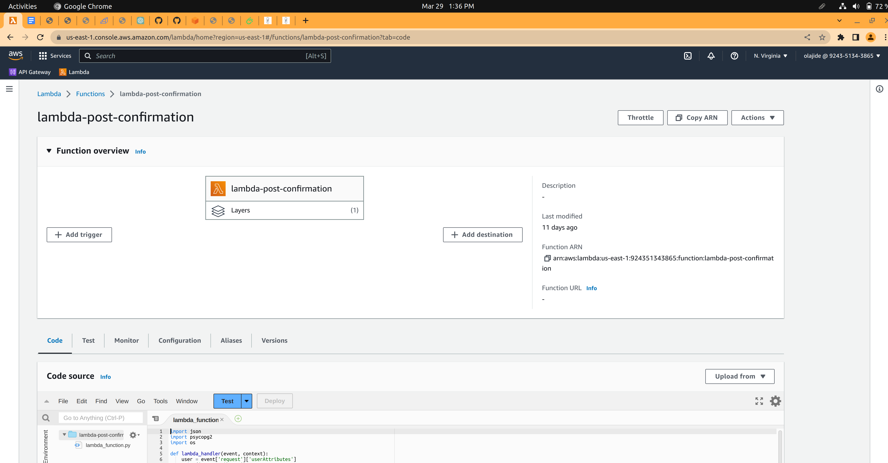
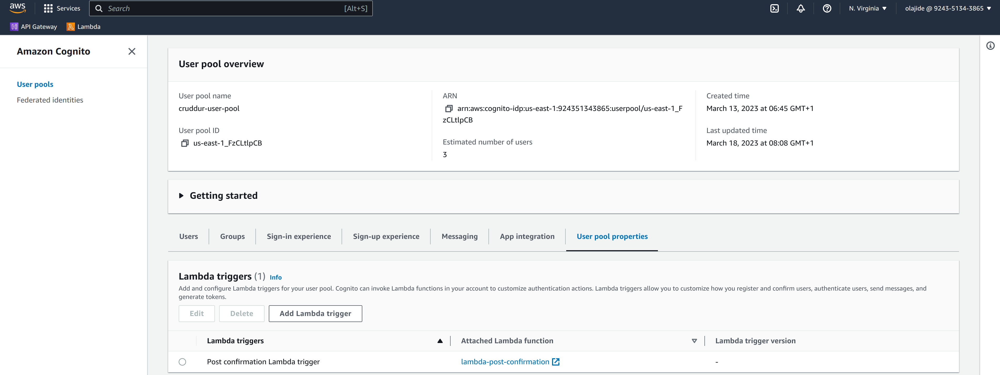

# Create new activities with a database insert

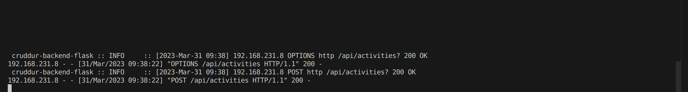
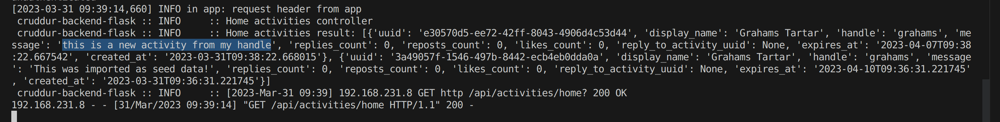
