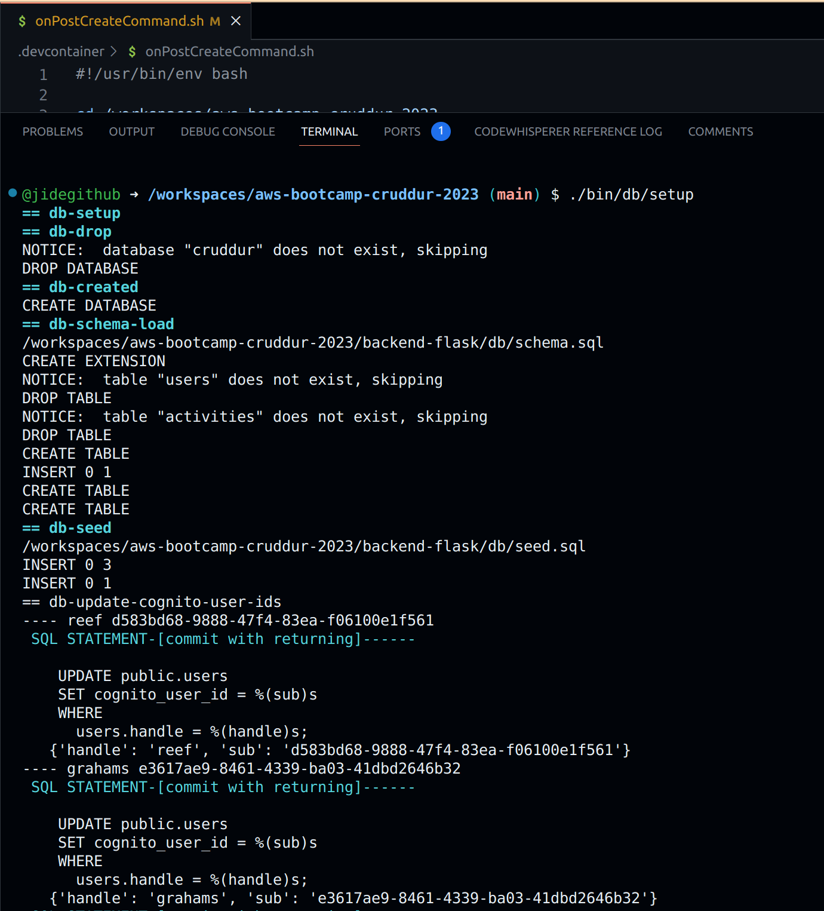
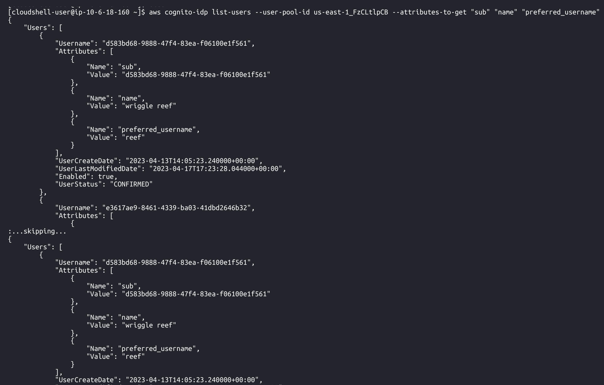
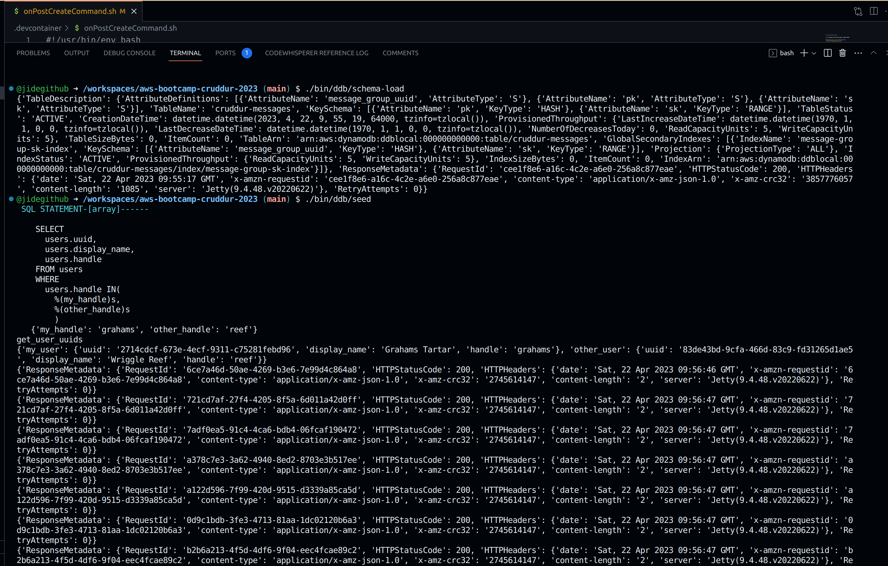
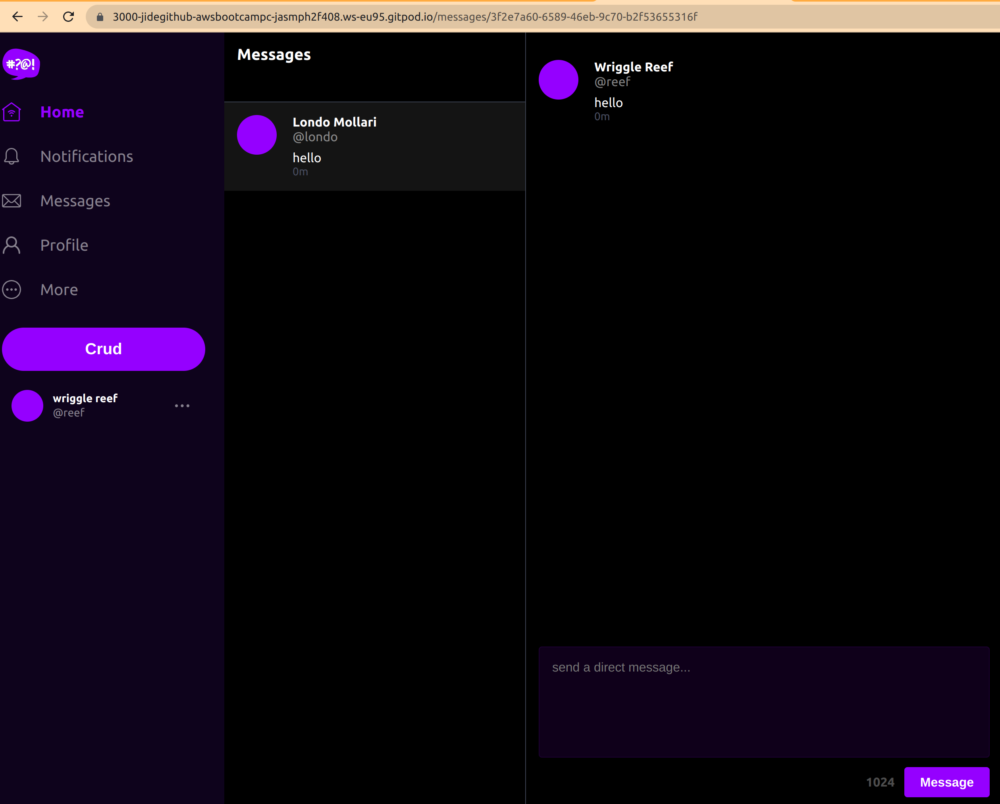
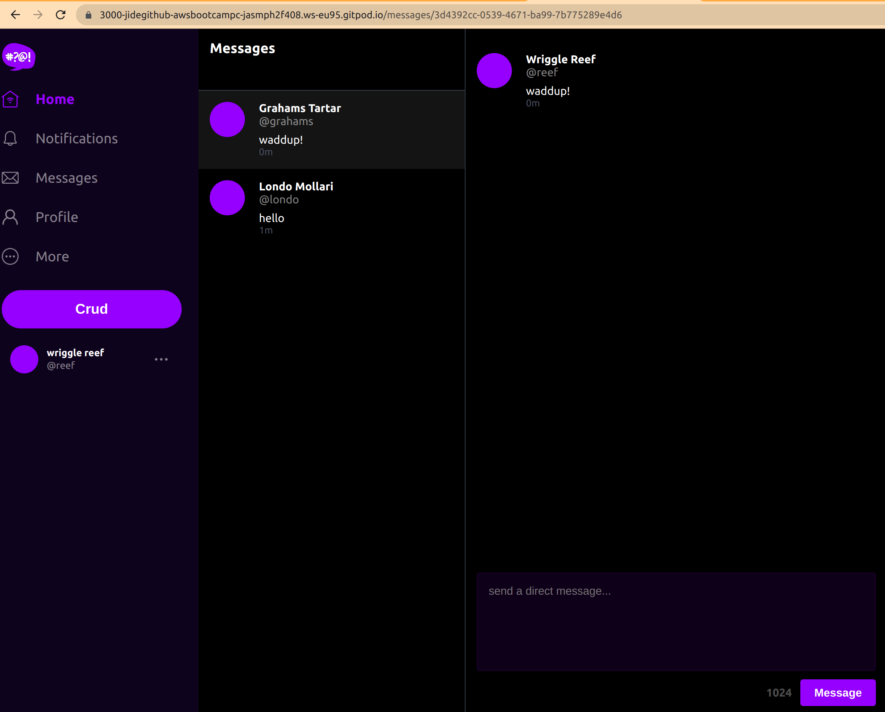
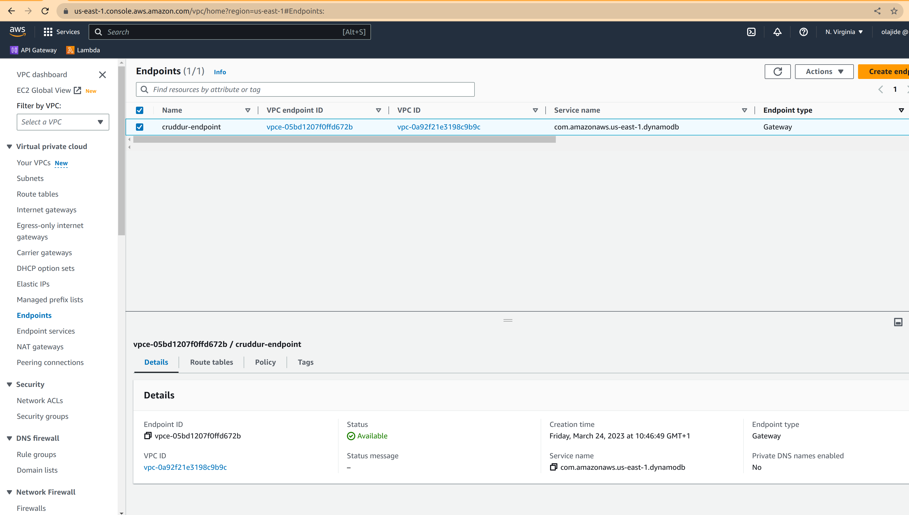
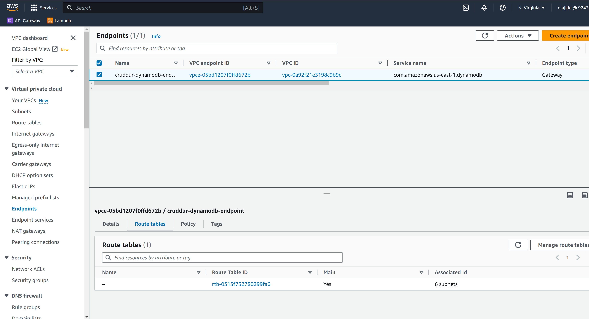
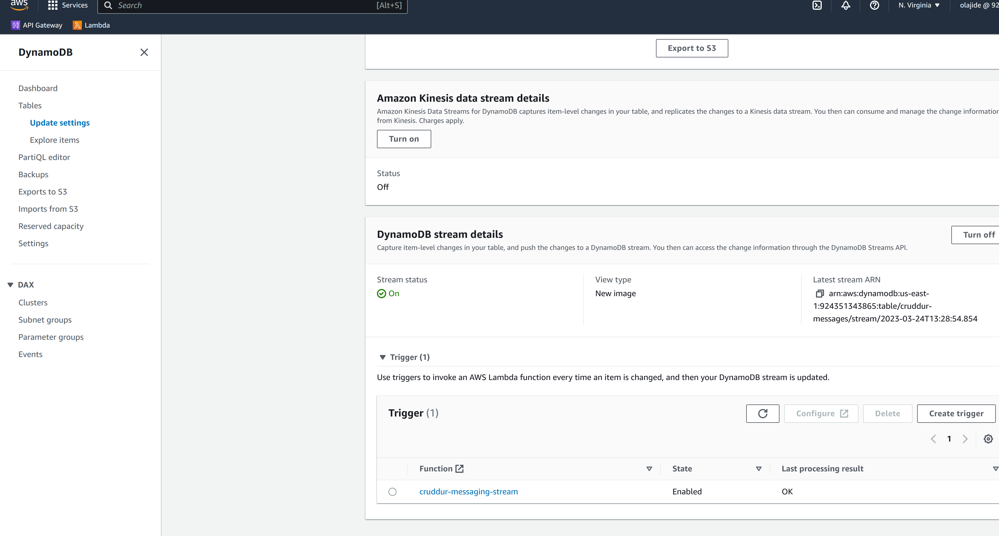
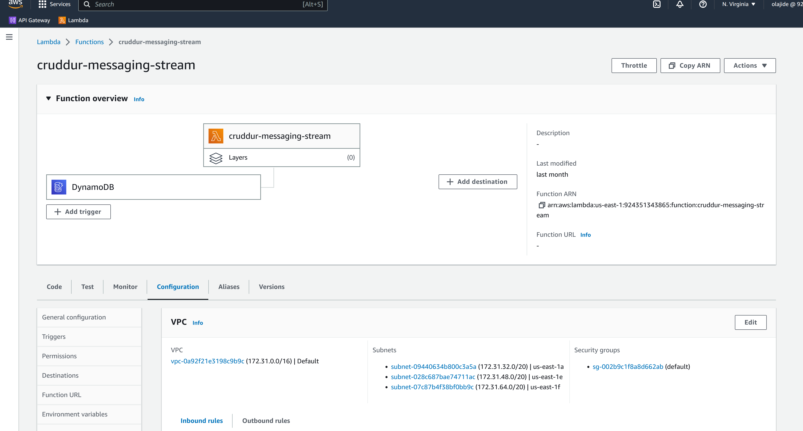

# Week 5 — DynamoDB and Serverless Caching

- [Data Modelling](#data-modelling)
- [Backend Preparation](#backend-preparation)
- [DynamoDB Utility Scripts](#dynamodb-utility-scripts)
- [Implement Conversations with DynamoDB Local](#implement-conversations-with-dynamodb-local)
- [Implement DynamoDB Stream with AWS Lambda](#implement-dynamodb-stream-with-aws-lambda)

## Data Modelling

Single Table Design is a data modelling technique in which all related data is stored in a single database table. We applied this design with DynamoDB for the Direct Messaging System in our Cruddur application. Here, data access can be break down into four patterns:

1. Pattern A for showing messages. Users can see a list of messages that belong to a message group.
2. Pattern B for showing message groups. Users can see a list of message groups so they can check the other persons they have been chatting with.
3. Pattern C for creating a new message in a new message group.
4. Pattern D for creating a new message in an existing message group.

Accordingly, there are 3 types of items to put in our DynamoDB table.

```python
my_message_group = {
    'pk': {'S': f"GRP#{my_user_uuid}"},
    'sk': {'S': last_message_at},
    'message_group_uuid': {'S': message_group_uuid},
    'message': {'S': message},
    'user_uuid': {'S': other_user_uuid},
    'user_display_name': {'S': other_user_display_name},
    'user_handle':  {'S': other_user_handle}
}

other_message_group = {
    'pk': {'S': f"GRP#{other_user_uuid}"},
    'sk': {'S': last_message_at},
    'message_group_uuid': {'S': message_group_uuid},
    'message': {'S': message},
    'user_uuid': {'S': my_user_uuid},
    'user_display_name': {'S': my_user_display_name},
    'user_handle':  {'S': my_user_handle}
}

message = {
    'pk':   {'S': f"MSG#{message_group_uuid}"},
    'sk':   {'S': created_at},
    'message': {'S': message},
    'message_uuid': {'S': message_uuid},
    'user_uuid': {'S': my_user_uuid},
    'user_display_name': {'S': my_user_display_name},
    'user_handle': {'S': my_user_handle}
}
```

## Backend Preparation

Restructure bash scripts so that there are 3 folders storing utility commands for Postgres database (`bin/db`), DynamoDB (`bin/db`), AWS RDS (`bin/rds`) and AWS Cognito (`bin/cognito`).

Add `boto3` into `backend-flask/requirements.txt`, which is the AWS SDK for Python to create, configure, and manage AWS services such as DynamoDB.

# Add the Following Utility Scripts
- schema_load   : Load schema
- scan          : Scan cruddur-messages table
- seed          : Push mock data to cruddur-messages table
- delete        : delete cruddur-messages table
- setup         : Load_schema/seed and set cognito id
- conversations : list all conversations
- conversation  : List handler conversation
- cognito       : Update Local Postgres users table with corresponding cognito user ID

All the dynamoDB scripts [Click here](../backend-flask/bin/ddb). 

For the local Postgres database:

- Update seed data in `backend-flask/db/seed.sql` ([code](../backend-flask/db/seed.sql)) to have 3 users and 1 activity (NOTE: set one user the same as the one you used for cruddur signin to avoid potential data conflicts).
- Create `bin/cognito/list-users` ([code](../backend-flask/bin/cognito/list-users)) to list users data saved in AWS Cognito.
- Create `bin/db/update_cognito_user_ids` ([code](../backend-flask/bin/db/update_cognito_user_ids)) to update users in the seed data with actual Cognito IDs if exist.
- Set `CONNECTION_URL: "postgresql://postgres:password@db:5432/cruddur"` in `docker-compose.yml`, because this week we are working with the users data queried from the local Postgres database named `cruddur`.

Add `python "$bin_path/db/update_cognito_user_ids"` to run `bin/db/update_cognito_user_ids` ([code](../backend-flask/bin/db/update_cognito_user_ids)) in the end of `bin/db/setup` ([code](../backend-flask/bin/db/setup)). If we compose up the docker and run the setup script, it will create a local Postgres database named `cruddur` with 2 tables(public.users & public.activities). In the `users` table, 1 user with handle `grahams` will be updated with actual AWS Cognito ID, which matches the value if we check with `./bin/cognito/list-users` as shown in the screenshot below.




We can also update a dummy cognito ID manually for another user `bayko` by the following commands:

```sh
./bin/db/connect
UPDATE public.users SET cognito_user_id = 'f73f4b05-a59e-468b-8a29-a1c39e7a2222' WHERE users.handle = 'bayko';
\q
```

## DynamoDB Utility Scripts

In the directory `bin/ddb/`, create the following utility scripts to easily setup, teardown, and debug DynamoDB data.

- `schema-load` ([code](../bin/ddb/schema-load)): create a table named `cruddur-messages` either for DynamoDB local or on the AWS
- `list-tables` ([code](../bin/ddb/list-tables)): list the name of tables we created
- `drop` ([code](../bin/ddb/drop)): drop a table by its name, e.g. `drop cruddur-messages`
- `seed` ([code](../bin/ddb/seed)): load the seed data into the table `cruddur-messages` with hard-coded `message_group_uuid` (**NOTE**: to avoid potential data conflict, I replaced `my_handle` from `andrewbrown` to `grahams`; Plus, `created_at` should be set back a couple of hours so that seed messages are not created for the future time. References on datetime issues can be seen [here](https://github.com/omenking/aws-bootcamp-cruddur-2023/blob/week-5-timezones/journal/week5.md))
- `scan` ([code](../bin/ddb/scan)): scan all the items saved in the table `cruddur-messages`
- `patterns/get-conversation` ([code](../bin/ddb/patterns/get-conversation)): list messages associated with the hard-coded `message_group_uuid` and print the consumed capacity
- `patterns/list-conversations` ([code](../bin/ddb/patterns/list-conversations)): list message groups and print the consumed capacity.

Then we can run `./bin/ddb/schema-load` and then `./bin/ddb/seed` to actually load the seed data into our local DynamoDB. The terminal will print out info as seen in the screenshot below.



Following are the proof of running other scripts.

`./bin/ddb/scan` returns:

```sh
{'user_uuid': 'f3325485-4b52-4625-8f34-0d323abdf0b7', 'message_group_uuid': '5ae290ed-55d1-47a0-bc6d-fe2bc2700399', 'user_handle': 'reef', 'sk': '2023-03-24T09:45:01.561513+00:00', 'pk': 'GRP#e3fe4ac1-cadf-43c4-80af-45edc81ca5d7', 'message': 'this is a filler message', 'user_display_name': 'Wriggle Reef'}
...
{'user_uuid': 'e3fe4ac1-cadf-43c4-80af-45edc81ca5d7', 'user_handle': 'grahams', 'sk': '2023-03-24T06:45:01.561513+00:00', 'pk': 'MSG#5ae290ed-55d1-47a0-bc6d-fe2bc2700399', 'message_uuid': '481723ea-6f5e-4f48-a177-1da5f3f8417d', 'message': "Have you ever watched Babylon 5? It's one of my favorite TV shows!", 'user_display_name': 'Grahams Tartar'}
{'user_uuid': 'f3325485-4b52-4625-8f34-0d323abdf0b7', 'user_handle': 'reef', 'sk': '2023-03-24T06:46:01.561513+00:00', 'pk': 'MSG#5ae290ed-55d1-47a0-bc6d-fe2bc2700399', 'message_uuid': '4064301e-0762-405e-aa78-6b2d6ee7110e', 'message': "Yes, I have! I love it too. What's your favorite season?", 'user_display_name': 'Wriggle Reef'}
{'user_uuid': 'e3fe4ac1-cadf-43c4-80af-45edc81ca5d7', 'user_handle': 'grahams', 'sk': '2023-03-24T06:47:01.561513+00:00', 'pk': 'MSG#5ae290ed-55d1-47a0-bc6d-fe2bc2700399', 'message_uuid': 'ff010a6b-e073-4660-aaa8-c45f97f58e79', 'message': 'I think my favorite season has to be season 3. So many great episodes, like "Severed Dreams" and "War Without End."', 'user_display_name': 'Grahams Tartar'}
{'user_uuid': 'f3325485-4b52-4625-8f34-0d323abdf0b7', 'user_handle': 'reef', 'sk': '2023-03-24T06:48:01.561513+00:00', 'pk': 'MSG#5ae290ed-55d1-47a0-bc6d-fe2bc2700399', 'message_uuid': '9d150549-63fb-4e61-a7e2-72c85beb454e', 'message': 'Yeah, season 3 was amazing! I also loved season 4, especially with the Shadow War heating up and the introduction of the White Star.', 'user_display_name': 'Wriggle Reef'}
...
{'user_uuid': 'e3fe4ac1-cadf-43c4-80af-45edc81ca5d7', 'message_group_uuid': '5ae290ed-55d1-47a0-bc6d-fe2bc2700399', 'user_handle': 'grahams', 'sk': '2023-03-24T09:45:01.561513+00:00', 'pk': 'GRP#f3325485-4b52-4625-8f34-0d323abdf0b7', 'message': 'this is a filler message', 'user_display_name': 'Grahams Tartar'}
```

`./bin/ddb/patterns/get-conversation` returns:

```sh
{
  "ConsumedCapacity": {
    "CapacityUnits": 1.0,
    "TableName": "cruddur-messages"
  },
  "Count": 20,
  "Items": [
    {
      ...
      "message": {
        "S": "I thought the special effects in Babylon 5 were really impressive, especially for a show that aired in the 90s. The use of CGI to create the spaceships and other sci-fi elements was really innovative for its time."
      },
      "message_uuid": {
        "S": "2ab91e7b-0531-41c4-bd5c-1ee7321ba741"
      },
      "pk": {
        "S": "MSG#5ae290ed-55d1-47a0-bc6d-fe2bc2700399"
      },
      "sk": {
        "S": "2023-03-24T08:10:01.561513+00:00"
      },
      "user_display_name": {
        "S": "Wriggle Reef"
      },
      "user_handle": {
        "S": "reef"
      },
      "user_uuid": {
        "S": "f3325485-4b52-4625-8f34-0d323abdf0b7"
      }
    },
    {
      "message": {
        "S": "One thing that really stands out about Babylon 5 is the quality of the special effects. What did you think about the show's use of CGI and other visual effects?"
      },
      "message_uuid": {
        "S": "68b3d3be-3807-48b1-ae39-7150db0a5602"
      },
      "pk": {
        "S": "MSG#5ae290ed-55d1-47a0-bc6d-fe2bc2700399"
      },
      "sk": {
        "S": "2023-03-24T08:09:01.561513+00:00"
      },
      "user_display_name": {
        "S": "Grahams Tartar"
      },
      "user_handle": {
        "S": "grahams"
      },
      "user_uuid": {
        "S": "e3fe4ac1-cadf-43c4-80af-45edc81ca5d7"
      }
    }
  ],
  "LastEvaluatedKey": {
    "pk": {
      "S": "MSG#5ae290ed-55d1-47a0-bc6d-fe2bc2700399"
    },
    "sk": {
      "S": "2023-03-24T08:09:01.561513+00:00"
    }
  },
  "ResponseMetadata": {
    "HTTPHeaders": {
      "content-type": "application/x-amz-json-1.0",
      "date": "Fri, 24 Mar 2023 09:51:14 GMT",
      "server": "Jetty(9.4.48.v20220622)",
      "transfer-encoding": "chunked",
      "x-amz-crc32": "3652665931",
      "x-amzn-requestid": "0d2b0b20-fc1f-42c9-b9e5-e272ee01f86d"
    },
    "HTTPStatusCode": 200,
    "RequestId": "0d2b0b20-fc1f-42c9-b9e5-e272ee01f86d",
    "RetryAttempts": 0
  },
  "ScannedCount": 20
}
{
  "CapacityUnits": 1.0,
  "TableName": "cruddur-messages"
}
grahams  2023-03-24 08:09 AM   One thing that really stands out about B...
reef       2023-03-24 08:10 AM   I thought the special effects in Babylon...
grahams  2023-03-24 08:11 AM   Yes, I was really blown away by the leve...
reef       2023-03-24 08:12 AM   And I also appreciated the way the show ...
grahams  2023-03-24 08:13 AM   Absolutely. The show had a great balance...
reef       2023-03-24 08:14 AM   And it's also worth noting the way the s...
grahams  2023-03-24 08:15 AM   Yes, I agree. And it's impressive how th...
reef       2023-03-24 08:16 AM   Definitely. And it's one of the reasons ...
grahams  2023-03-24 08:17 AM   Agreed. And it's also worth noting the w...
reef       2023-03-24 08:18 AM   Yes, it definitely had a big impact on t...
grahams  2023-03-24 08:19 AM   Another character I wanted to discuss is...
reef       2023-03-24 08:20 AM   Zathras was a really unique and memorabl...
grahams  2023-03-24 08:21 AM   Yes, I thought he was a great addition t...
reef       2023-03-24 08:22 AM   And I appreciated the way the show used ...
grahams  2023-03-24 08:23 AM   Definitely. It was a great way to integr...
reef       2023-03-24 08:24 AM   Yeah, that was a clever storytelling dev...
grahams  2023-03-24 08:25 AM   I also thought that Zathras was a great ...
reef       2023-03-24 08:26 AM   Yes, that's a good point. Babylon 5 was ...
grahams  2023-03-24 08:27 AM   And Zathras was just one example of that...
reef       2023-03-24 08:28 AM   Definitely. I think his character is a g...
```

`./bin/ddb/patterns/list-conversations` returns:

```sh
  SQL STATEMENT-[value]------

    SELECT
      users.uuid
    FROM users
    WHERE
      users.handle =%(handle)s
   {'handle': 'grahams'}

my-uuid: e3fe4ac1-cadf-43c4-80af-45edc81ca5d7

{
  "ConsumedCapacity": {
    "CapacityUnits": 0.5,
    "TableName": "cruddur-messages"
  },
  "Count": 1,
  "Items": [
    {
      "message": {
        "S": "this is a filler message"
      },
      "message_group_uuid": {
        "S": "5ae290ed-55d1-47a0-bc6d-fe2bc2700399"
      },
      "pk": {
        "S": "GRP#e3fe4ac1-cadf-43c4-80af-45edc81ca5d7"
      },
      "sk": {
        "S": "2023-03-24T09:45:01.561513+00:00"
      },
      "user_display_name": {
        "S": "Wriggle Reef"
      },
      "user_handle": {
        "S": "reef"
      },
      "user_uuid": {
        "S": "f3325485-4b52-4625-8f34-0d323abdf0b7"
      }
    }
  ],
  "ResponseMetadata": {
    "HTTPHeaders": {
      "content-length": "447",
      "content-type": "application/x-amz-json-1.0",
      "date": "Fri, 24 Mar 2023 09:52:38 GMT",
      "server": "Jetty(9.4.48.v20220622)",
      "x-amz-crc32": "395179250",
      "x-amzn-requestid": "eba57367-3785-42d4-9036-6d5cf360e58e"
    },
    "HTTPStatusCode": 200,
    "RequestId": "eba57367-3785-42d4-9036-6d5cf360e58e",
    "RetryAttempts": 0
  },
  "ScannedCount": 1
}
```

## Implement Conversations with DynamoDB Local

Firstly, create `backend-flask/lib/ddb.py` ([code](../backend-flask/lib/ddb.py)) which creates `class Ddb` to reuse its functions in other scripts. Since this section is to work with local Dynamodb, set `AWS_ENDPOINT_URL: "http://dynamodb-local:8000"` in `docker-compose.yml` which points to the local DynamoDB service.

Implementation of creating a new message, which mainly uses `create_message` of the `Ddb` class:

- Update the content for `body` in `frontend-react-js/src/components/MessageForm.js`
- Update function `data_create_message` in `backend-flask/app.py`
- Update `backend-flask/services/create_message.py` which has two modes - "update" the new message to an existing message group, or "create" the new message with a new message group
- Create `backend-flask/db/sql/users/create_message_users.sql`

Implementation for extra pages, which mainly uses `create_message_group` of the `Ddb` class:

- Import `MessageGroupNewPage` from `./pages/MessageGroupNewPage` and add the corresponding router in `frontend-react-js/src/App.js`
- Create `frontend-react-js/src/pages/MessageGroupNewPage.js`
- Create `frontend-react-js/src/components/MessageGroupNewItem.js`
- Add the endpoint and function for user short in `backend-flask/app.py`
- Create `backend-flask/services/users_short.py`
- Create `backend-flask/db/sql/users/short.sql`
- Update `frontend-react-js/src/components/MessageGroupFeed.js`
- Update `frontend-react-js/src/components/MessageForm.js`

After completing the above steps, compose up and go to the frontend, sign in and visit the messages tab, it shows the seed data. If I send a direct message to reef, the message will be presented in the bottom of the current message group:

## Implement (Pattern A &  Pattern B) Listing Messages in Message Group into Application	(showing a single conversation)






<!-- ## Implement (Pattern C) Creating a Message for an existing Message Group into Application	


## Implement (Pattern D) Creating a Message for a new Message Group into Application	
### Please watch the video

 -->

## Implement (Pattern E) Updating a Message Group using DynamoDB Streams

Lambda function [click here ](../aws/lambda/crrudur/cruddur-messaging-stream.py)

Create lambda function with the neccessary Role and Permission found here [here](../aws/lambda/crrudur/cruddur-messaging-stream.py)

1. Create a VPC gateway endpoint for dynamoDB so that our lambda can communicate with dynamoDB without passing through the public internet. This endpoint will be associated with a routing table so that it knows how and where to route traffic within the VPC




2. Create the stream 



3. Create the Lambda and set its trigger


