# Week 6 — Deploying Serverless Containers
This week was delivered together with [Week 7](../journal/week7.md), where I attached screenshots as the proofs of my working application.

- [Preparation](#preparation)
- [ECS Cluster and ECR Repo](#ecs-cluster-and-ecr-repo)
- [Images of Backend and Frontend](#images-of-backend-and-frontend)
- [AWS Roles and Security Groups](#aws-roles-and-security-groups)
- [Application Load Balancer](#application-load-balancer)
- [Domain Configuration](#domain-configuration)
- [Fargate Services and Tasks](#fargate-services-and-tasks)

## Context
For this project, I learnt the concept of Clusters, Namespaces, Services and Tasks. Tasks are basically json files that defines how to build a container. Services are very similar to those defined in a docker compose file, they are the image for a microservice within the context of some larger application. Examples of services might include an HTTP server, a database, or any other type of executable program that you wish to run in a distributed environment.Namespaces are isolated processes that have a different set of permissions than the system itself, In AWS cloud context, we use cloudmap. A cluster is a logical grouping of tasks or services. Your tasks and services are run on infrastructure that is registered to a cluster.
## Preparation
In the launched Cloud Developement Environment(CDE) workspace, we created scripts that generate environment variables saved as `backend-flask.env` and `frontend-react-js.env` in the root directory matching backend project folders and frontend respectively. These environmental variables are referenced in docker-compose service definitions. I created a ruby script that generate these variables based on if the USER environmental variable is either "codespace" or "gitpod", being the 2 CDEs I used through the entirety of this project.

```sh
./bin/backend/generate_env
./bin/frontend/generate_env
```

Using AWS Parameter store, we are storing sensitive data and passing sensitive data values to AWS for running backend-flask later:

```sh
aws ssm put-parameter --type "SecureString" --name "/cruddur/backend-flask/AWS_ACCESS_KEY_ID" --value $AWS_ACCESS_KEY_ID
aws ssm put-parameter --type "SecureString" --name "/cruddur/backend-flask/AWS_SECRET_ACCESS_KEY" --value $AWS_SECRET_ACCESS_KEY
aws ssm put-parameter --type "SecureString" --name "/cruddur/backend-flask/CONNECTION_URL" --value $PROD_CONNECTION_URL
aws ssm put-parameter --type "SecureString" --name "/cruddur/backend-flask/ROLLBAR_ACCESS_TOKEN" --value $ROLLBAR_ACCESS_TOKEN
aws ssm put-parameter --type "SecureString" --name "/cruddur/backend-flask/OTEL_EXPORTER_OTLP_HEADERS" --value "x-honeycomb-team=$HONEYCOMB_API_KEY"
```

## ECS Cluster and ECR Repo

Using AWS CLI, create a CloudWatch log group named `cruddur`, a ECS cluster named `cruddur`, and three ECR repos on AWS:

```sh
aws logs create-log-group --log-group-name cruddur
aws logs put-retention-policy --log-group-name cruddur --retention-in-days 1

aws ecs create-cluster \
 --cluster-name cruddur \
 --service-connect-defaults namespace=cruddur

aws ecr create-repository \
 --repository-name cruddur-python \
 --image-tag-mutability MUTABLE

aws ecr create-repository \
 --repository-name backend-flask \
 --image-tag-mutability MUTABLE

aws ecr create-repository \
 --repository-name frontend-react-js \
 --image-tag-mutability MUTABLE
```
## Images of Backend and Frontend

To avoid a single point of failure and potential rate limiting on dockerhub, Images were pushed to AWS Elastic Container Registry (ECR).

Pull a base image of python, then tag and push it to our ECR repo, this was also done with 3 other images

```sh
./bin/ecr/login

docker pull python:3.10-slim-buster
docker tag python:3.10-slim-buster $ECR_PYTHON_URL:3.10-slim-buster
docker push $ECR_PYTHON_URL:3.10-slim-buster
```

For the backend image, create `backend-flask/flask_app/health-check`, and update `backend-flask/app.py` to include route for health check. For development purposes, debug mode is turned on for a running flask app. In production, Flask is secured by not running in debug mode. Now we can build backend image and push it to ECR:

```sh
./bin/backend/build
./bin/ecr/login
./bin/backend/push
```

For the frontend image, For development, we keep it as is. 
For production environment create a separate Dockerfile: `frontend-react-js/Dockerfile.prod` and `frontend-react-js/nginx.conf`, which is a neccessary Nginx configuration file to run our application since we will be deploying the React app build on Nginx. Now we can build frontend image and push it to ECR:

```sh
./bin/frontend/build
./bin/ecr/login
./bin/frontend/push
```
## AWS Roles and Security Groups

AWS is a sucker for service roles and permissions. To enable the running container service to communicate with other services and execute commands on your behalf add AWS policies for `CruddurServiceExecutionRole` and `CruddurServiceExecutionPolicy`.

Based on the above files, create the ExecutionRole and attach policies:

```sh
aws iam create-role \
  --role-name CruddurServiceExecutionRole \
  --assume-role-policy-document file://aws/policies/service-assume-role-execution-policy.json

aws iam put-role-policy \
  --policy-name CruddurServiceExecutionPolicy \
  --role-name CruddurServiceExecutionRole \
  --policy-document file://aws/policies/service-execution-policy.json

aws iam attach-role-policy \
  --policy-arn arn:aws:iam::aws:policy/CloudWatchFullAccess \
  --role-name CruddurServiceExecutionRole

aws iam attach-role-policy \
  --policy-arn arn:aws:iam::aws:policy/service-role/AmazonECSTaskExecutionRolePolicy \
  --role-name CruddurServiceExecutionRole
```

Then create the TaskRole `CruddurTaskRole` and attach policies:

```sh
aws iam create-role \
    --role-name CruddurTaskRole \
    --assume-role-policy-document "{
  \"Version\":\"2012-10-17\",
  \"Statement\":[{
    \"Action\":[\"sts:AssumeRole\"],
    \"Effect\":\"Allow\",
    \"Principal\":{
      \"Service\":[\"ecs-tasks.amazonaws.com\"]
    }
  }]
}"

aws iam put-role-policy \
  --policy-name SSMAccessPolicy \
  --role-name CruddurTaskRole \
  --policy-document "{
  \"Version\":\"2012-10-17\",
  \"Statement\":[{
    \"Action\":[
      \"ssmmessages:CreateControlChannel\",
      \"ssmmessages:CreateDataChannel\",
      \"ssmmessages:OpenControlChannel\",
      \"ssmmessages:OpenDataChannel\"
    ],
    \"Effect\":\"Allow\",
    \"Resource\":\"*\"
  }]
}"

aws iam attach-role-policy \
  --policy-arn arn:aws:iam::aws:policy/CloudWatchFullAccess \
  --role-name CruddurTaskRole

aws iam attach-role-policy \
  --policy-arn arn:aws:iam::aws:policy/AWSXRayDaemonWriteAccess \
  --role-name CruddurTaskRole
```

Get `DEFAULT_VPC_ID` and `DEFAULT_SUBNET_IDS` in order to create a security group named `crud-srv-sg` that has inbound rules for port 4567 and 3000, and then authorize the default security group to expose RDS port 5432.

```sh
export DEFAULT_VPC_ID=$(aws ec2 describe-vpcs \
--filters "Name=isDefault, Values=true" \
--query "Vpcs[0].VpcId" \
--output text)
echo $DEFAULT_VPC_ID

export DEFAULT_SUBNET_IDS=$(aws ec2 describe-subnets  \
 --filters Name=vpc-id,Values=$DEFAULT_VPC_ID \
 --query 'Subnets[*].SubnetId' \
 --output json | jq -r 'join(",")')
echo $DEFAULT_SUBNET_IDS

export CRUD_SERVICE_SG=$(aws ec2 create-security-group \
  --group-name "crud-srv-sg" \
  --description "Security group for Cruddur services on ECS" \
  --vpc-id $DEFAULT_VPC_ID \
  --query "GroupId" --output text)
echo $CRUD_SERVICE_SG

aws ec2 authorize-security-group-ingress \
  --group-id $CRUD_SERVICE_SG \
  --protocol tcp \
  --port 4567 \
  --cidr 0.0.0.0/0

aws ec2 authorize-security-group-ingress \
  --group-id $CRUD_SERVICE_SG \
  --protocol tcp \
  --port 3000 \
  --cidr 0.0.0.0/0

aws ec2 authorize-security-group-ingress \
  --group-id $DB_SG_ID \
  --protocol tcp \
  --port 5432 \
  --source-group $CRUD_SERVICE_SG
```

## Application Load Balancer

Provision and configure Application Load Balancer along with target groups via AWS console:

- Basic configurations: name `cruddur-alb`, Internet-facing, IPv4 address type;
- Network mapping: default VPC, select first three availability zones;
- Security groups: create a new security group named `cruddur-alb-sg`, set inbound rules of HTTP and HTTPS from anywhere, and Custom TCP of 4567 and 3000 from anywhere (set description as TMP1 and TMP2); In addition, edit inbound rules of security group `crud-srv-sg`, instead of anywhere, set port source from `cruddur-alb-sg`, set description of port 4567 as ALBbackend, and port 3000 as ALBfrontend;
- Listeners and routing: HTTP:4567 with a new target group named `cruddur-backend-flask-tg`, select type as IP addresses, set HTTP:4567, set health check as `/api/health-check` with 3 healthy threshold, get its arn to put in `aws/json/service-backend-flask.json`; Add another listener HTTP:3000 with another target group created named `cruddur-frontend-react-js`, don't care about health check, set 3 healthy threshold, get its arn to put in `aws/json/service-frontend-react-js.json`.

## Domain Configuration

I registered a domain name `jidecruddur.site` for this bootcamp via [namecheap](https://namecheap.com/). We can manage the domain using Route53 via hosted zone, create an SSL certificate via ACM, setup a record set for naked domain to point to frontend-react-js, and setup a record set for api subdomain to point to the backend-flask:

- At Route 53 > Hosted zones, create a new one with the registered domain name and the public type; Copy the values presented in the NS record type, and paste them into the porkbun nameservers (changes to your authoritative nameservers may take up to a couple of hours to propagate worldwide).
- At Certificate Manger, request a public certificate, add domain names of `jidecruddur.site` and `*.jidecruddur.site`, then enter the created certificate and click "Create records in Route 53", finally Route 53 will show two CNAME records.
- At Load Balancers, add a listener to make HTTP:80 redirect to HTTPS:443, and another one to make HTTPS:443 forward to frontend with certificate we created; edit rules for HTTPS:443 to add a new IF which sets Host Header as `api.jidecruddur.site` and sets THEN forward to `cruddur-backend-flask-tg`.
- At Route 53 > Hosted zones > jidecruddur.site, create a record without a record name, set type as "A - Route Traffic to an IPv4 address and some AWS resources", set route traffic as "Alias to Application and Classic Load Balancer" with the right region and load balancer, set routing policy as simple routing; do it again with record name `api.jidecruddur.site`.

## Fargate Services and Tasks

Add AWS task definitions for backend and frontend. Now we have everything required for tasks, and then register the tasks by:

```sh
./bin/backend/register
./bin/frontend/register
```

## Deploy Backend Flask app as a service to Fargate

```sh
aws ecs create-service --cli-input-json file://aws/json/service-backend-flask.json
```
### Backend service
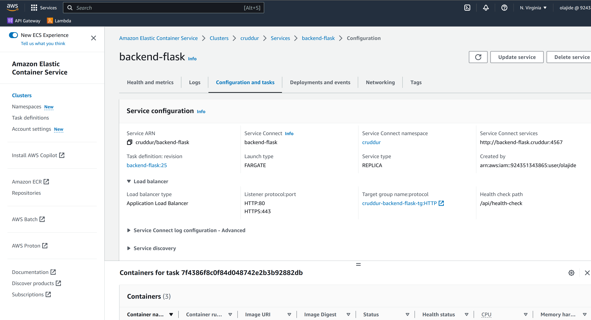

### Backend service task definition
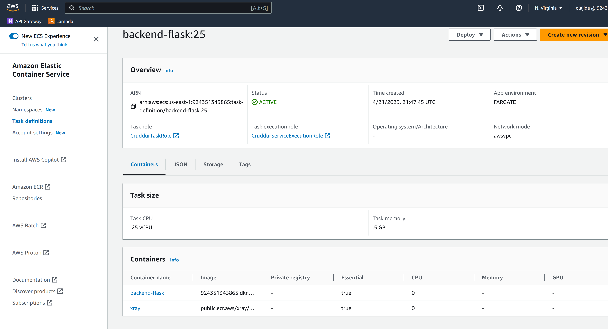

## Deploy Frontend React JS app as a service to Fargate	

```sh
aws ecs create-service --cli-input-json file://aws/json/service-frontend-react-js.json
```

### Frontend service
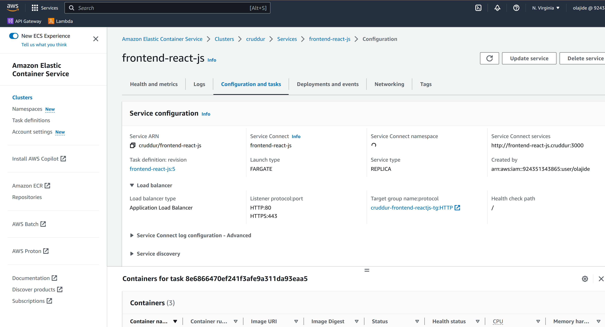

### Frontend service task


## Provision and configure Application Load Balancer along with target groups	

### ALB configuration 

Two rules are configured in the ALB with Two target group along with target group 

1. All traffic match /api/* with api.jidecruddur.site will be forwarded to backend ALB
2. Any traffic doesn't match the first rule will be forwarded to frontend target group 

### ALB 
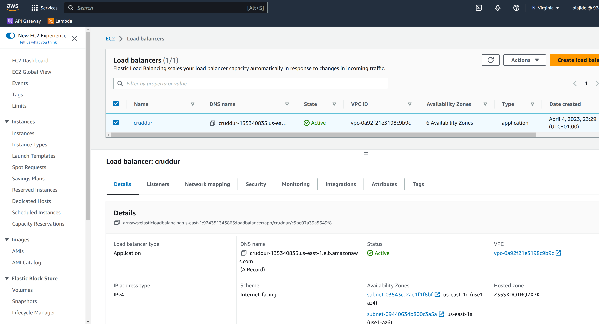

### ALB listener 

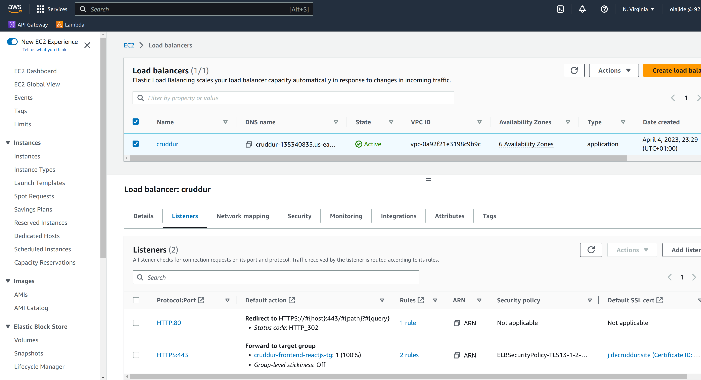

### ALB Rules

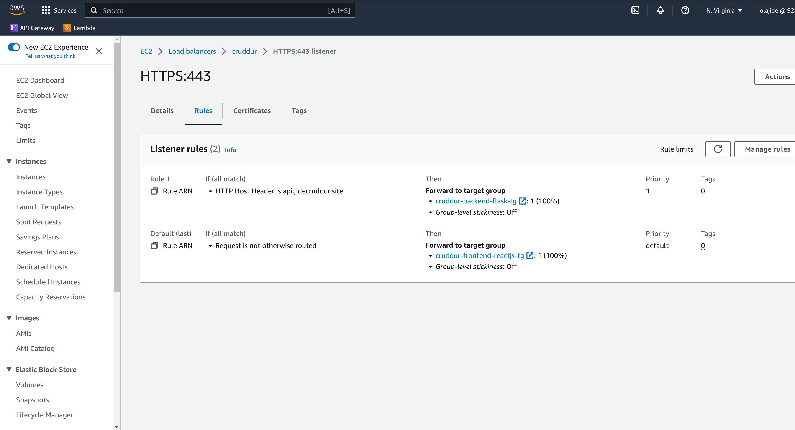

### Backend  Target group

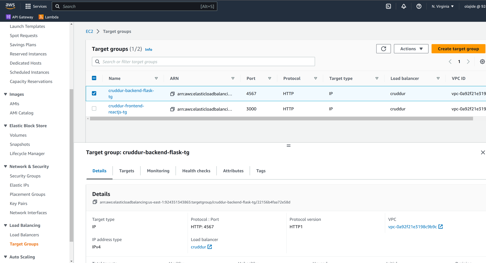

### Frontend  Target group

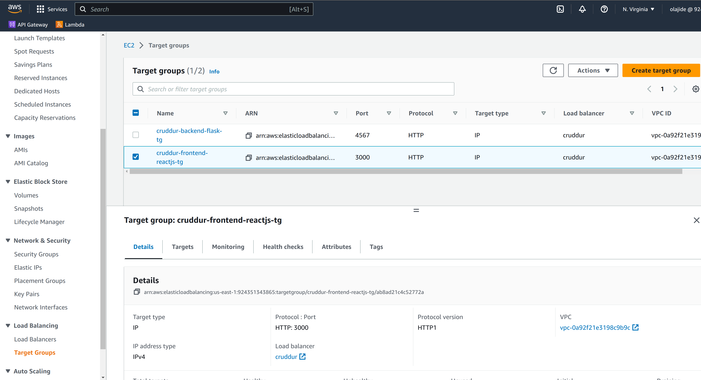


## Manage your domain using Route53 via hosted zone

### Route53 hosted zone 

In addition to the validation records and the NS one, two A record are created 

1. Alias jidecruddur.site pointing to the ALB
2. Alias api.jidecruddur.site pointing to the ALB

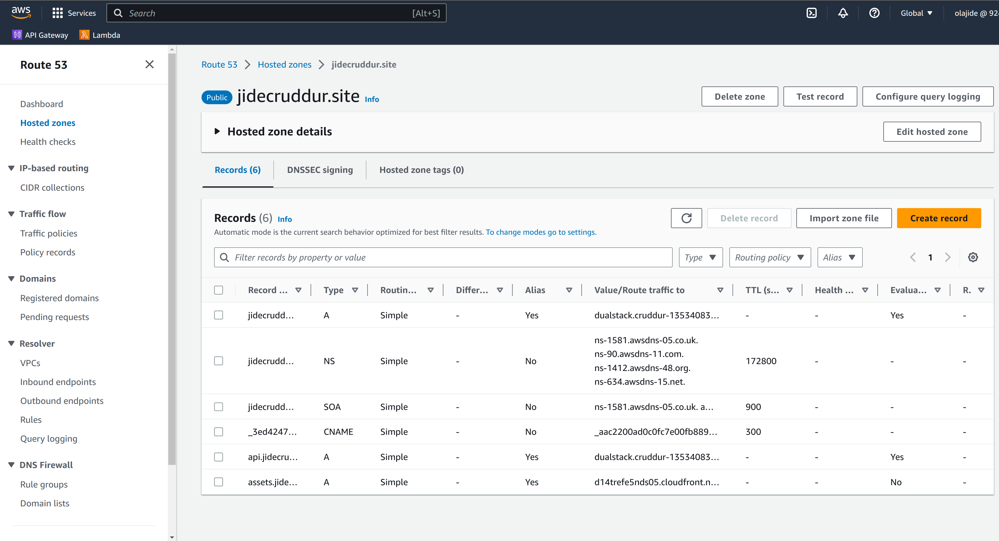

The root DNS is managed by [namecheap](https://namecheap.com), in order to have the subdomain jidecruddur.site managed by AWS, I have added a Nameserver(NS) record in namecheap to point to AWS NS server managing this zone 

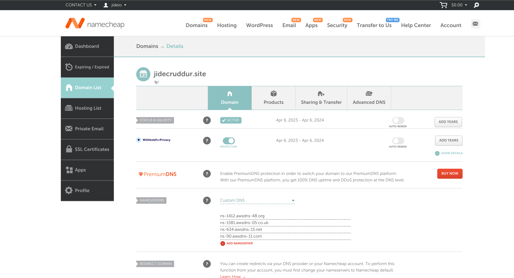

```bash
❯ nslookup jidecruddur.site
Server:		192.168.1.1
Address:	192.168.1.1#53

Non-authoritative answer:
Name:	jidecruddur.site
Address: 52.214.52.126
Name:	jidecruddur.site
Address: 34.254.140.116
Name:	jidecruddur.site
Address: 99.80.132.12
```
```bash
❯ nslookup  api.jidecruddur.site
Server:		192.168.1.1
Address:	192.168.1.1#53

Non-authoritative answer:
Name:	api.jidecruddur.site
Address: 99.80.132.12
Name:	api.jidecruddur.site
Address: 52.214.52.126
Name:	api.jidecruddur.site
Address: 34.254.140.116
```
## Create an SSL cerificate via ACM

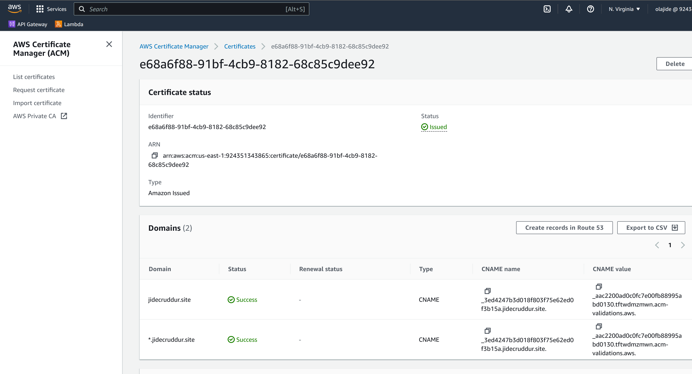

## Setup a record set for naked domain to point to frontend-react-js	

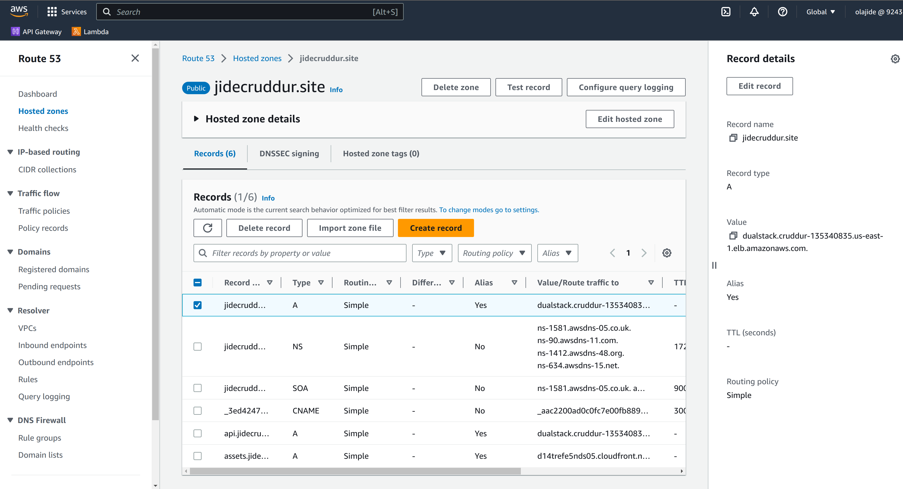

## Setup a record set for api subdomain to point to the backend-flask	

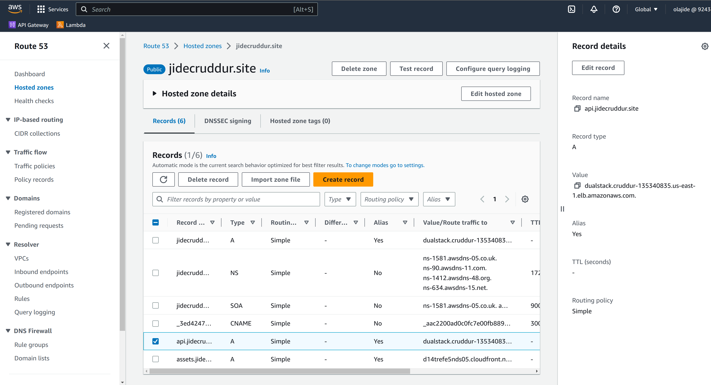

## Configure CORS to only permit traffic from our domain

### app.py

```python
cors = CORS(
    app,
    resources={r"/api/*": {"origins": origins}},
    expose_headers="Authorization",
    allow_headers=allow_headers,
    methods="OPTIONS,GET,HEAD,POST",
)
```
### Cruddur in production 

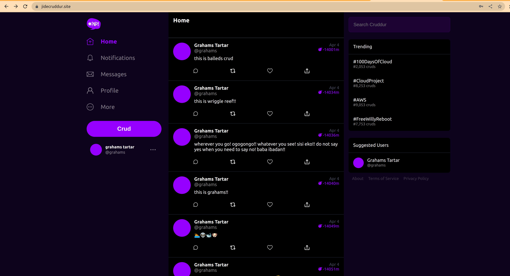


<!-- ## Configure task definitions to contain x-ray and turn on Container Insights	

### Container Insights enabled in the terraform module 

[ecs cluster ](../terraform/stacks/ecs/ecs.tf#L4)

### Xray task definition

[ecs cluster ](../terraform/stacks/ecs/backend_flask.tf#L106-L116)

### Xray in the AWS UI


 -->


## Change Docker Compose to explicitly use a user-defined network

[docker dev](../docker-compose-codespaces.yml#L169)

```bash
networks: 
  cruddur-network:
    driver: bridge
    name: cruddur
```
## Create Dockerfile specfically for production use case
[backend](../backend-flask/Dockerfile.prod)
[frontend](../frontend-react-js/Dockerfile.prod)