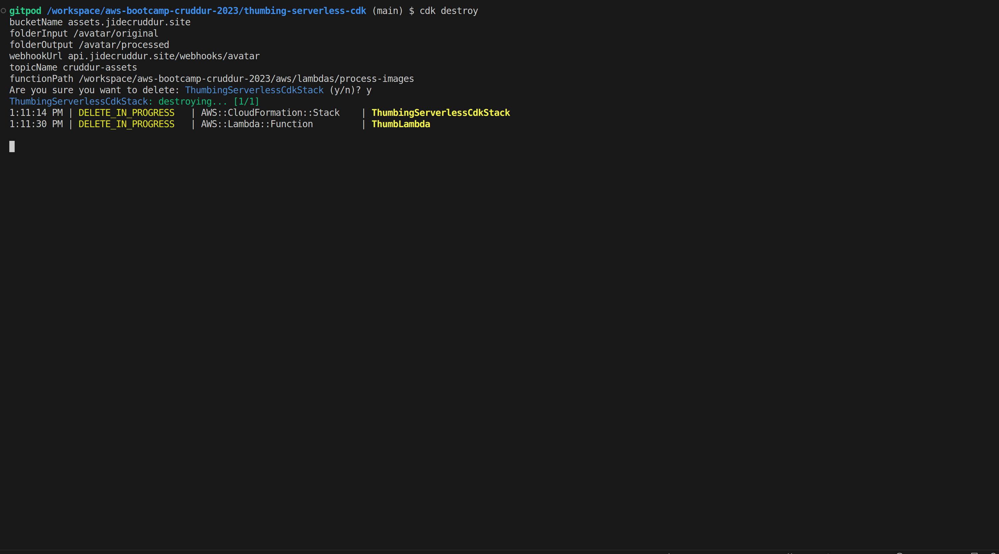
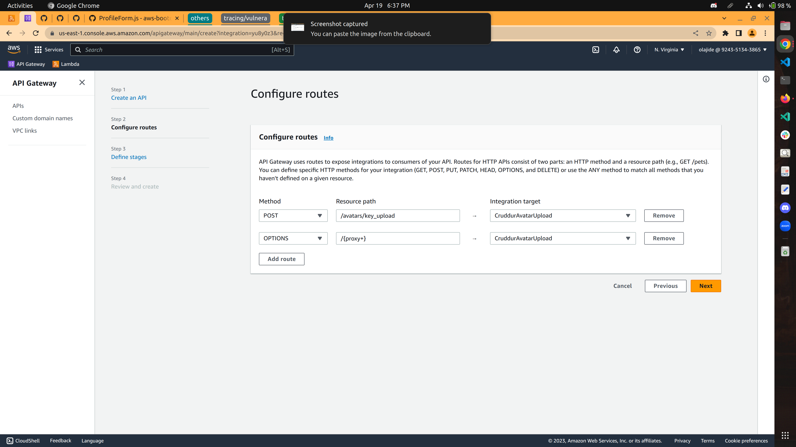
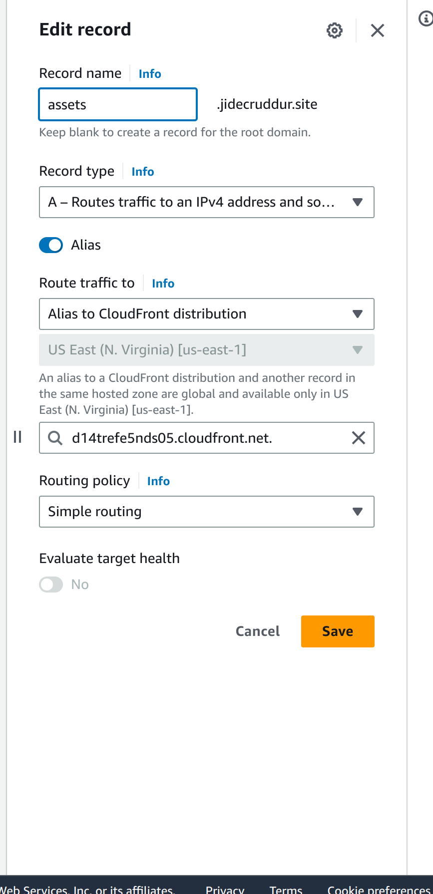

# Week 8 — Serverless Image Processing

- [Preparation](#preparation)
- [Implement CDK Stack](#implement-cdk-stack)
- [Serving Avatars via CloudFront]((#serving-avatars-via-cloudfront))

## Preparation

This week we need to use CDK (Cloud Development Kit) to create S3 buckets, Lambda functions, SNS topics, etc., allowing users to upload their avatars to update their profiles.
By default, AWS account will not execute cdk commands until you bootstrap it. Deploying stacks with the AWS CDK requires dedicated Amazon S3 buckets and other containers to be available to AWS CloudFormation during deployment.

```sh
cdk bootstrap "aws://$AWS_ACCOUNT_ID/$AWS_DEFAULT_REGION"
```
now you can run cdk commands.

# Implement CDK Stack

Firstly, manually create a S3 bucket named `assets.<domain_name>` (e.g., `assets.jidecruddur.site`), which will be used for serving the processed images in the profile page. In this bucket, create a folder named `banners`, and then upload a `banner.jpg` into the folder. The bucket was created manually so that the it's fireproof from `cdk destroy` command or any other cdk command that recreates or update resources. 

[CDK Stack](../thumbing-serverless-cdk/)




# Serve Avatars via CloudFront


# Implement Users Profile Page


# Implement Users Profile Form


# Implement Backend Migrations

[Backend Migration](../bin/db/migrate)


# Presigned URL generation via Ruby Lambda

[Lambda function](../aws/lambdas/cruddur-upload-avatar/)


# HTTP API Gateway with Lambda Authorizer

[Lambda function](../aws/lambdas/lambda-authorizer/)


Create HTTP API in API Gateway and attach authorizer




# API gateway custom domain

- Configure a custom domain api.jidecruddur.site
- Configure Mapping between API gateway and the custom domain
- Add an alias for api.jidecruddur.site in route53 to point to the API gateway

# Create JWT Lambda Layer

[Lambda layer script](../bin/lambda-layers/)


# Render Avatars in App via CloudFront


 


