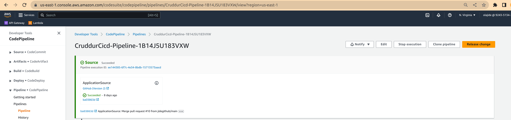
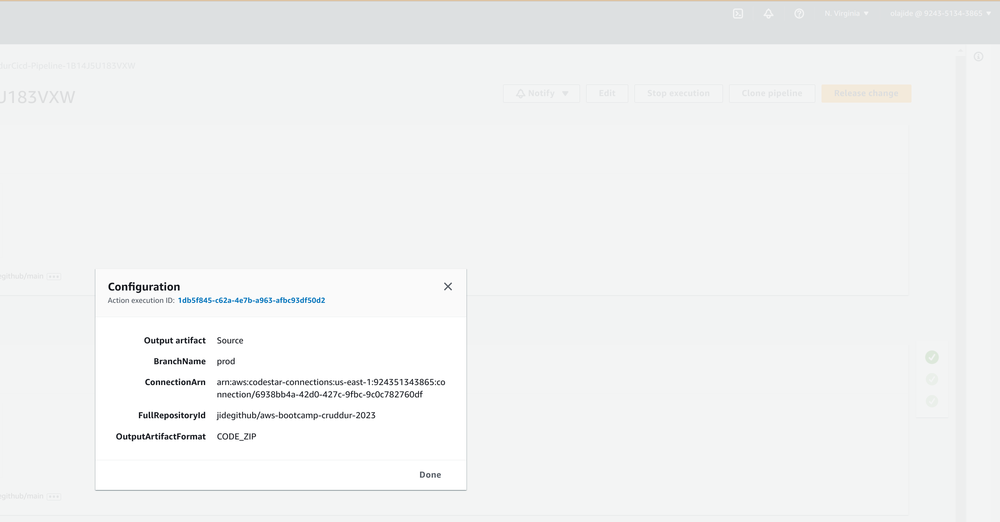
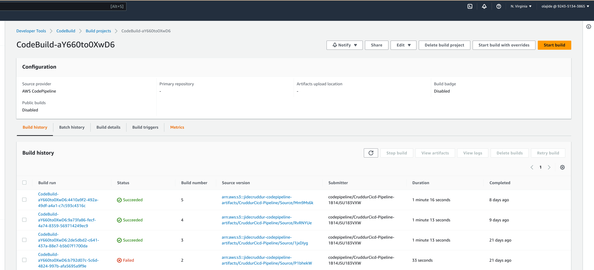
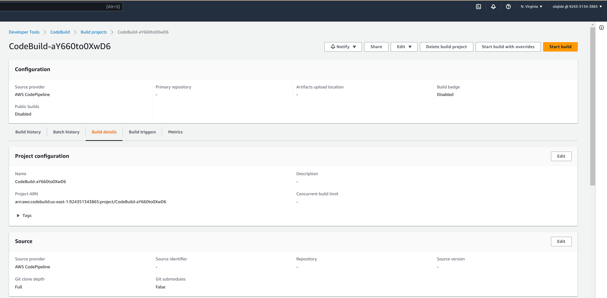
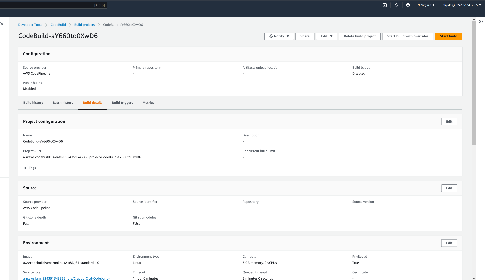
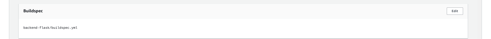
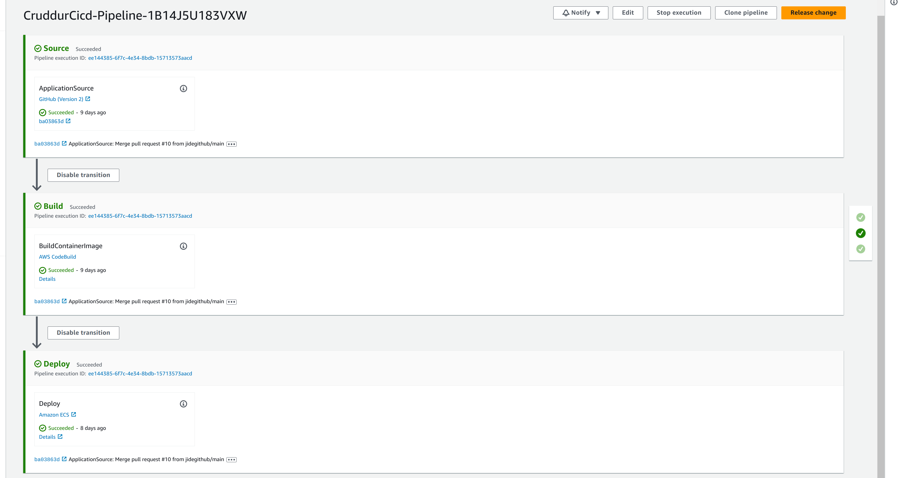
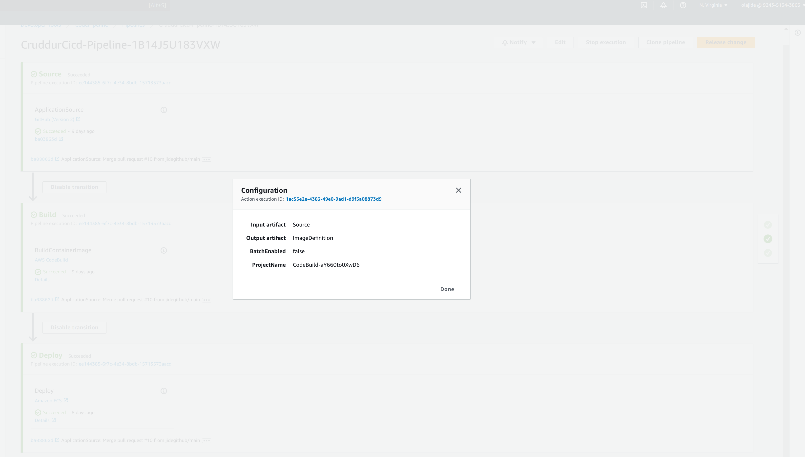
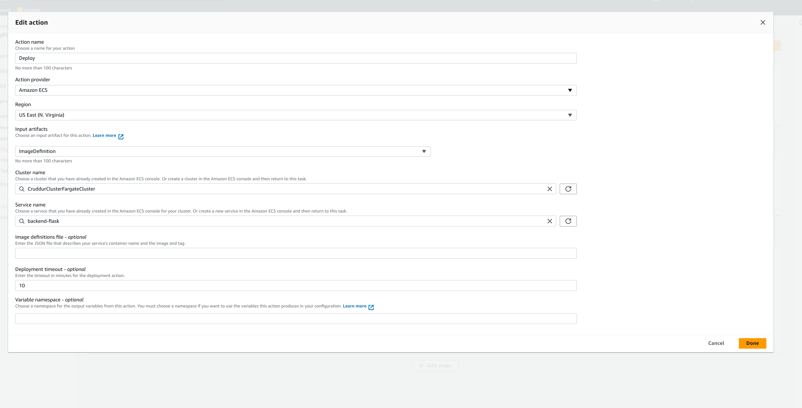

# Week 9 — CI/CD with CodePipeline, CodeBuild and CodeDeploy

<!-- - [Required Homework](#required-homework) -->
- [CodePipeline](#codepipeline)
- [CodeBuild Project](#codebuild-project)
- [buildspec](#buildspec)
  - [buildspec role](#buildspec-role)
- [Add Build stage to Pipeline](#add-build-stage-to-pipeline)
- [Deploy stage](#deploy-stage)
- [Run Pipeline](#run-pipeline)
  - [Test Deployment](#test-deployment)
- [Homework Challenges](#homework-challenges)
  - [Create Test stage and Add Step to CodePipeline](#create-test-stage-and-add-step-to-codepipeline)
    - [Creating sample test in backend-flask using pytest](#creating-sample-test-in-backend-flask-using-pytest)
    - [Create the buildspec files](#create-the-buildspec-files)
    - [Create the Codebuild project for each related action](#create-the-codebuild-project-for-each-related-action)
    - [Create the Codepipeline stage for tests and add all the 3 actions](#create-the-codepipeline-stage-for-tests-and-add-all-the-3-actions)
- [Deploy stage](#deploy-stage-1)
- [Test](#test)


<!-- ## Required Homework

To save some money with CodeBuild, I used [githubAction](../.github/workflows) to deploy in **main** branch and codepipeline to deploy in **prod** branch -->

## CodePipeline
- Create a pipeline resource with cloudformation 
    
    

## CodeBuild Project
- Create a CodeBuild resource with cloudformation


- Add source as AWS CodePipeline

    

- Environment


- BuildSpec



## buildspec

I used this file to build the image

[buildspec.yml](../backend-flask/pipeline/buildspec.yml)

### buildspec role

```json 
{
    "Version": "2012-10-17",
    "Statement": [
        {
            "Effect": "Allow",
            "Action": [
                "ecr:GetAuthorizationToken",
                "ecr:BatchCheckLayerAvailability",
                "ecr:GetDownloadUrlForLayer",
                "ecr:GetRepositoryPolicy",
                "ecr:DescribeRepositories",
                "ecr:ListImages",
                "ecr:DescribeImages",
                "ecr:BatchGetImage",
                "ecr:GetLifecyclePolicy",
                "ecr:GetLifecyclePolicyPreview",
                "ecr:ListTagsForResource",
                "ecr:DescribeImageScanFindings",
                "ecr:InitiateLayerUpload",
                "ecr:UploadLayerPart",
                "ecr:CompleteLayerUpload",
                "ecr:PutImage"
            ],
            "Resource": "*"
        }
    ]
}
```

## Add Build stage to Pipeline
**set Output artifact to ContainerDefinition**



## Deploy stage
**set Input artifact to ContainerDefinition**


## Run Pipeline

- Edit the project and push to **prod** branch in order to trigger the pipeline OR run manually from the GUI

### Test Deployment

Update return in app.py health check like this to return something new.

```bash
return {"success": True, "ver": 1}, 200
```
Push the changes to prod and visit API health check URL

<!-- ## Homework Challenges

### Create Test stage and Add Step to CodePipeline

#### Creating sample test in backend-flask using pytest

- Add the bellow packages to [requirements.txt](../backend-flask/requirements.txt)
  * black[d]==22.12.0
  * pytest==7.2.0
  * pylint==2.17.2
  * pylint-exit==1.2.0
- Run pip install -r backend-flask/requirements.txt
- Create a [tests](../backend-flask/tests/) folder in the backend flask directory.
- Inside the [tests](../backend-flask/tests/) directory, create a [conftest.py](../backend-flask/tests/conftest.py) file to configure pytest.

- Create a [test](../backend-flask/tests/test_routes.py) file and add all the unit test

- Add the target function in the [Makefile](../Makefile)

    - python-tests
    - python-lint
    - python-format


- Run pytest to test the Flask application.
```sh
make python-tests
PYTHONPATH=backend-flask py.test  --junitxml "/Users/z.damene/training/bootcamps/aws/aws-bootcamp-cruddur-2023/output/results_.xml"
============================================================ test session starts =============================================================
platform darwin -- Python 3.10.9, pytest-7.2.0, pluggy-1.0.0
rootdir: /Users/z.damene/training/bootcamps/aws/aws-bootcamp-cruddur-2023
collecting ...  cruddur :: INFO     :: AWS XRAY URL: *127.0.0.1*
collected 1 item                                                                                                                             

backend-flask/tests/test_routes.py .                                                                                                   [100%]

============================================================== warnings summary ==============================================================
backend-flask/services/middleware/flask_cognito.py:3
backend-flask/services/middleware/flask_cognito.py:3
  /Users/z.damene/training/bootcamps/aws/aws-bootcamp-cruddur-2023/backend-flask/services/middleware/flask_cognito.py:3: DeprecationWarning: '_request_ctx_stack' is deprecated and will be removed in Flask 2.3.
    from flask import _request_ctx_stack, current_app, jsonify, request

-- Docs: https://docs.pytest.org/en/stable/how-to/capture-warnings.html
------------------ generated xml file: /Users/z.damene/training/bootcamps/aws/aws-bootcamp-cruddur-2023/output/results_.xml ------------------
======================================================= 1 passed, 2 warnings in 4.48s ========================================================
```

#### Create the buildspec files
I have created a stage **tests** with three actions 
- Pytest to run the unitest with the file [pytest_buildspec.yml](../backend-flask/pipeline/pytest_buildspec.yml)
- Format to check that the code is formated correctly with the file [format_buildspec.yml](../backend-flask/pipeline/format_buildspec.yml)
-  Lint to check that the code is linted with pylint with [pylint_buildspec.yml](../backend-flask/pipeline/pylint_buildspec.yml)

#### Create the Codebuild project for each related action

- cruddur-backend-flask-lint

- cruddur-backend-flask-format

- cruddur-backend-flask-tests


#### Create the Codepipeline stage for tests and add all the 3 actions


## Deploy stage

- Create the ECS cluster if not exists
    ```sh
    cd cd terraform/config/ecs
    terragrunt apply
    ```

- Deploy stage 
    
    
     -->

## Test 

Connect to https://jidecruddur.site/api/health-check


